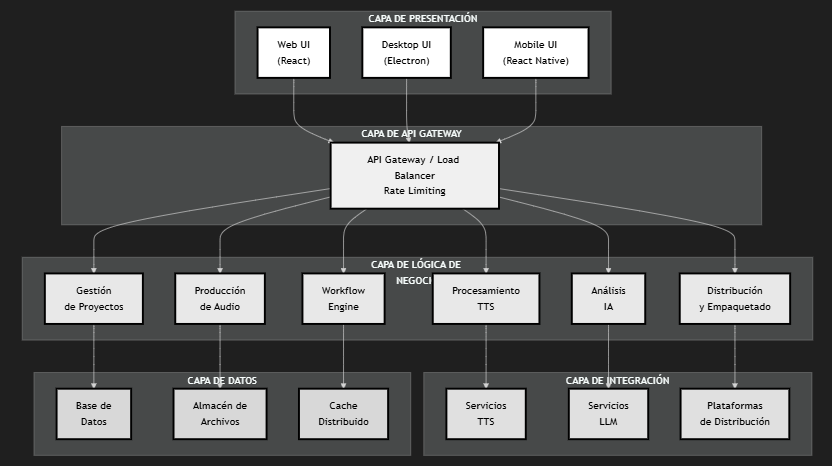
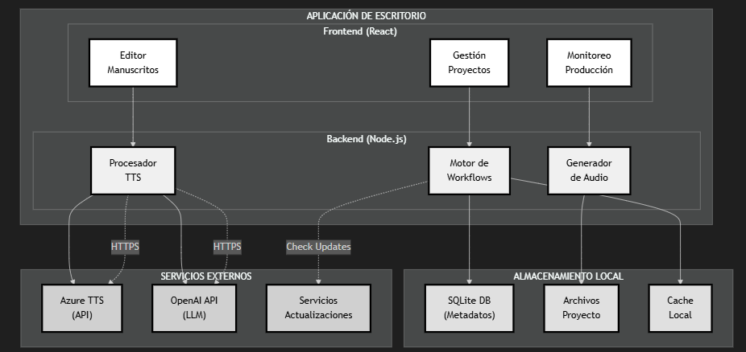
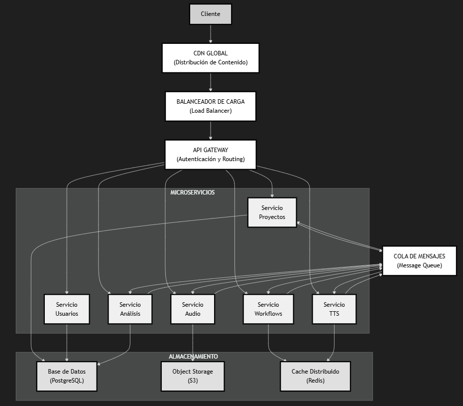
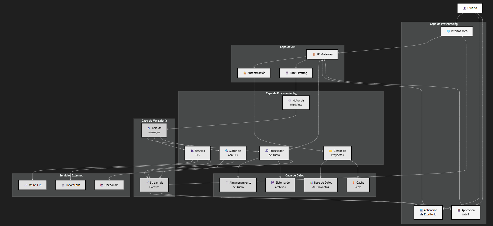
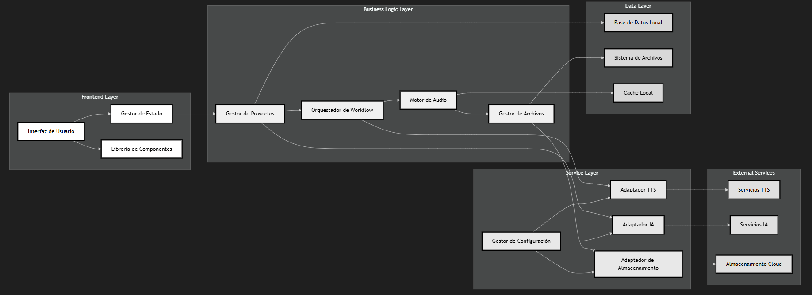

# Audeek

## Arquitectura y Diseño del Sistema de Producción de Audiolibros con Voces Sintéticas

**Contexto:** Este documento describe la arquitectura técnica y el diseño del sistema para la producción automatizada de audiolibros utilizando tecnologías de síntesis de voz (TTS). El diseño contempla una implementación inicial como sistema autónomo (standalone) con evolución hacia una plataforma basada en la nube.

---

## Tabla de Contenidos

1. [Visión General del Sistema](#1-visión-general-del-sistema)
2. [Arquitectura de Referencia](#2-arquitectura-de-referencia)
3. [Fase 1: Sistema Autónomo](#3-fase-1-sistema-autónomo)
4. [Fase 2: Plataforma en la Nube](#4-fase-2-plataforma-en-la-nube)
5. [Componentes del Sistema](#5-componentes-del-sistema)
6. [Gestión de Datos](#6-gestión-de-datos)
7. [Integración con Servicios Externos](#7-integración-con-servicios-externos)
8. [Seguridad y Cumplimiento Normativo](#8-seguridad-y-cumplimiento)
9. [Escalabilidad y Rendimiento](#9-escalabilidad-y-rendimiento)
10. [Estrategia de Migración](#10-estrategia-de-migración)
11. [Consideraciones Técnicas](#11-consideraciones-técnicas)
12. [Hoja de Ruta de Implementación](#12-hoja-de-ruta-de-implementación)

---

## 1) Visión General del Sistema

**Propósito del Sistema:** El sistema es una plataforma integral para la producción automatizada y escalable de audiolibros de alta calidad utilizando tecnologías avanzadas de síntesis de voz, procesamiento de lenguaje natural y flujos de trabajo optimizados.

**Filosofía de Diseño:**
* **Modularidad** — arquitectura basada en componentes independientes y reutilizables
* **Escalabilidad** — capacidad de crecimiento desde implementaciones locales hasta plataformas empresariales
* **Interoperabilidad** — integración fluida con servicios externos de TTS, IA y distribución
* **Usabilidad** — interfaces intuitivas que democratizan la producción de audiolibros
* **Calidad** — enfoque en resultados profesionales con validación automatizada

**Usuarios Objetivo:**
* **Productores independientes** — autores y pequeñas editoriales
* **Empresas editoriales** — casas editoriales medianas y grandes
* **Distribuidores de contenido** — plataformas de audiolibros y agregadores
* **Proveedores de servicios** — empresas especializadas en producción de audio

**Principios Arquitectónicos:**
* **Separation of Concerns** — separación clara entre lógica de negocio, presentación y datos
* **API-First Design** — todas las funcionalidades expuestas a través de APIs bien definidas
* **Event-Driven Architecture** — comunicación asíncrona entre componentes
* **Microservicios** — servicios independientes con responsabilidades específicas
* **Infrastructure as Code** — automatización completa del despliegue y configuración

---

## 2) Arquitectura de Referencia

**Modelo de Arquitectura:** El sistema sigue un patrón de arquitectura híbrida que combina elementos de arquitecturas monolíticas modulares (Fase 1) y microservicios distribuidos (Fase 2), permitiendo una evolución gradual y controlada.

**Capas Arquitectónicas:**



**Patrones de Diseño Aplicados:**
* **Command Query Responsibility Segregation (CQRS)** — separación de operaciones de lectura y escritura
* **Event Sourcing** — almacenamiento de eventos para auditoría y reproducibilidad
* **Repository Pattern** — abstracción del acceso a datos
* **Factory Pattern** — creación de objetos complejos (pipelines de procesamiento)
* **Observer Pattern** — notificaciones de cambios de estado en workflows
* **Strategy Pattern** — intercambio de algoritmos de procesamiento

---

## 3) Fase 1: Sistema Autónomo

**Descripción de la Fase:** Implementación inicial como aplicación de escritorio autónoma que opera completamente en el entorno local del usuario, con conectividad limitada a servicios externos solo para TTS y funcionalidades específicas de IA.

**Características Principales:**
* **Instalación local** — aplicación de escritorio multiplataforma
* **Procesamiento local** — toda la lógica de negocio ejecuta en la máquina del usuario
* **Almacenamiento local** — proyectos y archivos gestionados localmente
* **Conectividad selectiva** — conexión a internet solo para servicios TTS y actualizaciones

**Arquitectura Técnica Fase 1:**



**Stack Tecnológico Fase 1:**
* **Frontend:** React + TypeScript + Electron
* **Backend:** Node.js + Express + TypeScript
* **Base de Datos:** SQLite (local)
* **Almacenamiento:** Sistema de archivos local
* **Procesamiento de Audio:** FFmpeg + Sox
* **Integración TTS:** Azure Cognitive Services SDK
* **Integración LLM:** OpenAI API / Azure OpenAI
* **Empaquetado:** Electron Builder

**Ventajas de la Fase 1:**
* **Privacidad completa** — todos los datos permanecen en el entorno local
* **Sin dependencias de conectividad** — funcionamiento offline para la mayoría de operaciones
* **Control total** — usuario tiene control completo sobre sus proyectos y datos
* **Costos predecibles** — solo costos de servicios TTS utilizados
* **Implementación rápida** — desarrollo y despliegue simplificados

**Limitaciones de la Fase 1:**
* **Escalabilidad limitada** — rendimiento limitado por hardware local
* **Colaboración restringida** — dificultad para trabajo en equipo
* **Backup manual** — responsabilidad del usuario para respaldar proyectos
* **Actualizaciones manuales** — proceso de actualización más complejo
* **Recursos computacionales** — dependiente del hardware del usuario

---

## 4) Fase 2: Plataforma en la Nube

**Descripción de la Fase:** Evolución hacia una plataforma completamente basada en la nube que ofrece escalabilidad empresarial, colaboración en tiempo real y capacidades avanzadas de procesamiento distribuido.

**Características Principales:**
* **SaaS completo** — Software as a Service accesible vía web
* **Procesamiento distribuido** — capacidades de procesamiento escalables
* **Colaboración en tiempo real** — múltiples usuarios trabajando simultáneamente
* **API pública** — integración con sistemas externos de terceros
* **Analytics avanzados** — inteligencia de negocio y métricas de rendimiento

**Arquitectura Técnica Fase 2:**



---


**Diagrama de Flujo de Datos del Sistema:**



**Ventajas de la Fase 2:** 

**Stack Tecnológico Fase 2:**
* **Frontend:** React + TypeScript + Next.js
* **API Gateway:** Azure API Management
* **Microservicios:** Node.js + Fastify / Go
* **Base de Datos:** Azure Database for PostgreSQL + Azure Cosmos DB
* **Storage:** Azure Blob Storage
* **Cache:** Azure Cache for Redis
* **Message Queue:** Azure Service Bus / Azure Event Hubs
* **Orquestación:** Azure Container Instances + Azure Kubernetes Service
* **Monitoreo:** Azure Monitor + Application Insights
* **CI/CD:** Azure DevOps / GitHub Actions

**Ventajas de la Fase 2:**
* **Escalabilidad ilimitada** — recursos adaptativos según demanda
* **Colaboración avanzada** — equipos distribuidos trabajando en tiempo real
* **Backup automático** — redundancia y recuperación ante desastres
* **Actualizaciones automáticas** — nuevas funcionalidades sin intervención del usuario
* **Analytics empresariales** — métricas y reportes avanzados
* **Integración empresarial** — APIs para integración con sistemas corporativos

**Consideraciones de la Fase 2:**
* **Conectividad requerida** — dependencia completa de conexión a internet
* **Costos variables** — modelo de suscripción basado en uso
* **Complejidad técnica** — arquitectura más compleja de mantener
* **Privacidad de datos** — datos almacenados en la nube
* **Compliance** — cumplimiento de regulaciones de protección de datos


**Diagrama de Interacción de Componentes:**



---

## 5) Componentes del Sistema

**Motor de Workflows:** Núcleo del sistema que orquesta todos los procesos de producción de audiolibros, desde la ingesta del manuscrito hasta la entrega final.

**Funcionalidades del Motor:**
* **Definición de flujos** — configuración de pipelines de procesamiento personalizables
* **Ejecución asíncrona** — procesamiento paralelo y no bloqueante
* **Gestión de estados** — seguimiento detallado del progreso de cada proyecto
* **Manejo de errores** — recuperación automática y reintentos inteligentes
* **Validación automática** — checkpoints de calidad en cada etapa del proceso

**Procesador de Manuscritos:** Componente especializado en la análisis, sanitización y preparación de textos para síntesis TTS.

**Capacidades del Procesador:**
* **Análisis semántico** — identificación de estructura narrativa y elementos especiales
* **Sanitización TTS** — adaptación del texto para optimizar síntesis de voz
* **Detección de personajes** — identificación automática de roles y diálogos
* **Segmentación inteligente** — división del contenido respetando límites técnicos
* **Enriquecimiento contextual** — adición de metadatos para mejorar síntesis

**Orquestador TTS:** Sistema que gestiona la interacción con múltiples proveedores de servicios de síntesis de voz.

**Características del Orquestador:**
* **Multi-proveedor** — soporte para Azure Cognitive Services, Google Cloud TTS, ElevenLabs
* **Balanceo de carga** — distribución inteligente de requests
* **Fallback automático** — cambio automático entre proveedores en caso de fallos
* **Optimización de costos** — selección de proveedor basada en costo y calidad
* **Cache inteligente** — reutilización de audio previamente generado

**Procesador de Audio:** Motor de post-procesamiento que transforma el audio crudo TTS en audio de calidad profesional.

**Funcionalidades de Audio:**
* **Normalización automática** — ajuste de niveles según estándares de plataforma
* **Concatenación inteligente** — unión fluida de segmentos con gaps naturales
* **Mejora de calidad** — filtros sutiles para mejorar naturalidad
* **Generación de formatos** — exportación a múltiples formatos según plataforma objetivo
* **Validación de calidad** — métricas automáticas de calidad de audio

**Gestor de Distribución:** Componente que prepara y envía los audiolibros finalizados a las diferentes plataformas de distribución.

**Capacidades de Distribución:**
* **Empaquetado multi-plataforma** — generación de paquetes específicos por plataforma
* **Validación de requisitos** — verificación automática de especificaciones técnicas
* **Upload automatizado** — envío directo a plataformas compatibles
* **Seguimiento de publicación** — monitoreo del estado de publicación
* **Gestión de metadatos** — sincronización de información editorial

---

## 6) Gestión de Datos

**Modelo de Datos:** Diseño de base de datos que soporta tanto operaciones transaccionales como analíticas, optimizado para escalabilidad y rendimiento.

**Entidades Principales:**
* **Proyectos** — contenedor principal con metadatos de producción
* **Manuscritos** — texto fuente con versiones y historial de cambios
* **Personajes** — definiciones de roles con características vocales
* **Planificación** — configuraciones avanzadas y léxico especializado
* **Segmentos** — unidades de procesamiento TTS con estado y metadatos
* **Audio** — archivos generados con métricas de calidad
* **Distribución** — paquetes finales con información de entrega

**Estrategia de Almacenamiento:**

**Fase 1 (Local):**
```
Proyecto/
├── project.json           # Metadatos del proyecto
├── manuscript/           # Archivos fuente
│   ├── original.docx
│   └── processed/        # Versiones procesadas
├── planning/            # Configuración y planificación
│   ├── characters.json
│   ├── lexicon.json
│   └── segments.json
├── audio/              # Audio generado
│   ├── raw/            # Audio TTS crudo
│   ├── processed/      # Audio post-procesado
│   └── masters/        # Audio final por capítulo
└── deliverables/       # Paquetes finales
    ├── apple/
    ├── google/
    └── spotify/
```

**Fase 2 (Nube):**
```
Almacenamiento Híbrido:
├── Azure Database for PostgreSQL # Metadatos, usuarios, configuraciones
├── Azure Cosmos DB     # Documentos variables (manuscritos, planificación)
├── Azure Blob Storage # Archivos grandes (audio, imágenes)
├── Azure Cache for Redis # Cache de sesiones y datos frecuentes
└── Azure Cognitive Search # Búsqueda y analytics
```

**Patrones de Acceso a Datos:**
* **Repository Pattern** — abstracción de acceso a datos por entidad
* **Unit of Work** — transacciones atómicas para operaciones complejas
* **CQRS** — separación de comandos y consultas para optimización
* **Event Sourcing** — registro de eventos para auditoría y reproducibilidad
* **Cache-Aside** — estrategia de cache para datos de acceso frecuente

**Migración de Datos:**
* **Fase 1 → Fase 2:** Herramientas de sincronización para migrar proyectos locales a la nube
* **Importación masiva:** APIs para migración de bibliotecas existentes
* **Exportación completa:** capacidad de descargar todos los datos del usuario
* **Backup incremental:** respaldo automático de cambios en proyectos activos

---

## 7) Integración con Servicios Externos

**Proveedores de TTS:** Integración multi-proveedor para síntesis de voz con failover automático y optimización de costos.

**Azure Cognitive Services:**
* **Cobertura:** 140+ voces en 40+ idiomas
* **Características:** SSML avanzado, voces neurales, personalización
* **Límites:** 20 requests/seg, 200KB por request
* **Costos:** $4-16 USD por millón de caracteres

**Amazon Polly:**
* **Cobertura:** 60+ voces en 30+ idiomas
* **Características:** marcas de tiempo, efectos de habla
* **Límites:** 100 requests/seg, 6000 caracteres por request
* **Costos:** $4-16 USD por millón de caracteres

**Google Cloud Text-to-Speech:**
* **Cobertura:** 220+ voces en 40+ idiomas
* **Características:** WaveNet, personalización de voz
* **Límites:** 100 requests/seg, 5000 caracteres por request
* **Costos:** $4-16 USD por millón de caracteres

**Servicios de LLM:** Integración con modelos de lenguaje para análisis inteligente de manuscritos.

**OpenAI GPT:**
* **Uso:** Análisis de manuscritos, detección de personajes, mejoras de texto
* **Modelos:** GPT-4, GPT-3.5-turbo
* **Límites:** Variable según modelo y plan
* **Costos:** $0.03-0.12 USD por 1K tokens

**Azure OpenAI:**
* **Uso:** Alternativa empresarial con mejor compliance
* **Modelos:** GPT-4, GPT-3.5, Embedding models
* **Ventajas:** Integración con otros servicios Azure
* **Costos:** Similar a OpenAI con opciones empresariales

**Plataformas de Distribución:** APIs para envío automático a plataformas de audiolibros.

**Apple Books:**
* **Formato:** M4B con capítulos marcados
* **Metadatos:** Apple-specific requirements
* **Validación:** Automated content review
* **API:** Apple Books Partner API

**Google Play Books:**
* **Formato:** MP3/M4A con metadatos
* **Requisitos:** Google Play Console integration
* **Validación:** Content policy compliance
* **API:** Google Play Books Partner API

**Spotify for Podcasters:**
* **Formato:** Track-based audio books
* **Metadatos:** Podcast-style metadata
* **Distribución:** Via Spotify for Podcasters
* **API:** Spotify Web API

**Audible (ACX):**
* **Formato:** Audible-specific AAX/AAC
* **Proceso:** Manual upload with review
* **Requisitos:** Strict technical specifications
* **Integration:** Limited automation capabilities

---

## 8) Seguridad y Cumplimiento Normativo

**Arquitectura de Seguridad:** Implementación de seguridad en capas (defense in depth) que protege datos, comunicaciones y accesos en todos los niveles del sistema.

**Autenticación y Autorización:**
* **Multi-factor Authentication (MFA)** — autenticación de dos factores obligatoria
* **Single Sign-On (SSO)** — integración con proveedores corporativos (SAML, OAuth2)
* **Role-Based Access Control (RBAC)** — permisos granulares por rol y proyecto
* **API Key Management** — gestión segura de claves para integraciones
* **Session Management** — tokens JWT con expiración automática

**Cifrado de Datos:**
* **En tránsito:** TLS 1.3 para todas las comunicaciones
* **En reposo:** AES-256 para almacenamiento de archivos sensibles
* **Base de datos:** Cifrado a nivel de columna para datos personales
* **Claves:** Gestión de claves con Azure Key Vault
* **Backup:** Cifrado completo de copias de seguridad

**Cumplimiento Regulatorio:**
* **GDPR** — Regulación General de Protección de Datos (Europa)
* **CCPA** — Ley de Privacidad del Consumidor de California
* **LGPD** — Lei Geral de Proteção de Dados (Brasil)
* **SOC 2 Type II** — Auditoría de controles de seguridad
* **ISO 27001** — Certificación de gestión de seguridad de información

**Políticas de Privacidad:**
* **Minimización de datos** — recopilación solo de datos necesarios
* **Retención limitada** — eliminación automática según políticas definidas
* **Consentimiento explícito** — autorización clara para procesamiento de datos
* **Derecho al olvido** — capacidad de eliminar completamente datos del usuario
* **Portabilidad** — exportación de datos en formatos estándar

**Auditoría y Monitoreo:**
* **Logging completo** — registro de todas las acciones del sistema
* **Análisis de comportamiento** — detección de patrones anómalos
* **Alertas en tiempo real** — notificaciones de eventos de seguridad
* **Reportes de compliance** — informes automáticos para auditorías
* **Incident response** — protocolos definidos para respuesta a incidentes

---

## 9) Escalabilidad y Rendimiento 

**Estrategias de Escalabilidad:** Diseño que permite crecimiento horizontal y vertical según demanda, optimizando costos y rendimiento.

**Escalabilidad Horizontal:**
* **Microservicios independientes** — cada servicio escala según su demanda específica
* **Load balancing inteligente** — distribución de carga basada en capacidad y latencia
* **Auto-scaling** — ajuste automático de recursos según métricas de rendimiento
* **Geografic distribution** — despliegue en múltiples regiones para reducir latencia
* **Database sharding** — particionamiento de datos para mejorar rendimiento

**Optimización de Rendimiento:**
* **Caching estratégico** — cache en múltiples niveles (aplicación, base de datos, CDN)
* **Lazy loading** — carga diferida de recursos pesados
* **Asynchronous processing** — operaciones no bloqueantes con colas de mensajes
* **Connection pooling** — reutilización eficiente de conexiones de base de datos
* **Azure CDN** — distribución de contenido estático cerca del usuario

**Métricas de Rendimiento:**
* **Throughput:** 1000+ audiolibros procesados simultáneamente
* **Latency:** <200ms para operaciones de UI, <2s para operaciones de procesamiento
* **Availability:** 99.9% uptime con recuperación automática
* **Scalability:** Capacidad de 10x crecimiento sin reingeniería
* **Resource utilization:** <70% uso promedio de CPU y memoria

**Optimización de Costos TTS:**
* **Intelligent batching** — agrupación de requests para optimizar límites de API
* **Provider selection** — elección automática del proveedor más costo-efectivo
* **Caching agresivo** — reutilización de segmentos de audio similares
* **Regional optimization** — uso de servicios locales para reducir costos de transferencia
* **Usage prediction** — forecasting para optimizar planes de pricing

**Monitoreo de Performance:**
* **Application Performance Monitoring (APM)** — seguimiento detallado de rendimiento
* **Real User Monitoring (RUM)** — métricas de experiencia real del usuario
* **Synthetic monitoring** — pruebas automáticas de funcionalidad
* **Infrastructure monitoring** — seguimiento de recursos de hardware
* **Business metrics** — KPIs de negocio en tiempo real

---

## 10) Estrategia de Migración

**Roadmap de Migración:** Plan estructurado para la evolución del sistema autónomo hacia la plataforma en la nube, minimizando disrupciones y maximizando el valor para los usuarios.

**Fase de Transición (Fase 1.5):**
* **Funcionalidades híbridas** — algunas operaciones locales, otras en la nube
* **Sincronización opcional** — backup automático a la nube con control del usuario
* **Colaboración limitada** — compartir proyectos específicos con otros usuarios
* **Analytics básicos** — métricas de uso anónimas para mejora del producto
* **Updates automáticos** — actualizaciones de software vía internet

**Estrategias de Migración:**
* **Big Bang Migration** — migración completa en una ventana de mantenimiento
* **Strangler Fig Pattern** — reemplazo gradual de componentes
* **Database Migration** — herramientas automatizadas para migración de datos
* **Feature Flags** — activación gradual de nuevas funcionalidades
* **Rollback capabilities** — capacidad de revertir cambios si hay problemas

**Herramientas de Migración:**
* **Data Export/Import** — utilidades para transferir proyectos entre sistemas
* **Migration Assistant** — asistente guiado para migración de usuarios
* **Compatibility Checker** — validación de compatibilidad de proyectos
* **Migration Monitor** — seguimiento del progreso de migración
* **Rollback Tools** — herramientas para deshacer migraciones problemáticas

**Consideraciones del Usuario:**
* **Migración opcional** — usuarios pueden mantenerse en Fase 1 indefinidamente
* **Capacitación** — recursos educativos para nuevas funcionalidades
* **Soporte extendido** — soporte técnico durante período de transición
* **Pricing grandfathering** — precios preferenciales para usuarios existentes
* **Data ownership** — garantías de propiedad y control de datos

---

## 11) Consideraciones Técnicas

**Selección de Tecnologías:** Decisiones arquitectónicas basadas en criterios de rendimiento, mantenibilidad, ecosistema y experticia del equipo.

**Criterios de Selección:**
* **Madurez tecnológica** — estabilidad y soporte a largo plazo
* **Ecosistema activo** — comunidad vibrante y extenso ecosistema de librerías
* **Performance** — capacidad de manejar cargas de trabajo intensivas
* **Escalabilidad** — soporte nativo para crecimiento horizontal
* **Developer experience** — productividad del equipo de desarrollo
* **Cloud-native** — optimización para entornos de nube

**Stack Tecnológico Detallado:**

**Frontend Technologies:**
* **React 18+** — librería de UI con concurrent features
* **TypeScript 5+** — tipado estático para mejor mantenibilidad
* **Next.js 14+** — framework full-stack con SSR/SSG capabilities
* **Tailwind CSS** — framework de CSS utility-first
* **React Query** — gestión de estado del servidor
* **Electron** — para aplicaciones de escritorio multiplataforma

**Backend Technologies:**
* **Node.js 20+** — runtime JavaScript con performance optimizations
* **Fastify** — framework web de alto rendimiento
* **TypeScript** — desarrollo type-safe en backend
* **Prisma** — ORM moderno con type safety
* **GraphQL** — API query language para flexibilidad de cliente
* **Apollo Server** — servidor GraphQL enterprise-ready

**Database Technologies:**
* **Azure Database for PostgreSQL** — base de datos relacional administrada con JSON support
* **Azure Cosmos DB** — base de datos NoSQL administrada para datos semi-estructurados
* **Azure Cache for Redis** — cache en memoria administrado y message broker
* **Azure Cognitive Search** — motor de búsqueda y analytics administrado
* **SQLite** — base de datos embebida para Fase 1

**Infrastructure Technologies:**
* **Docker** — containerización de aplicaciones
* **Azure Kubernetes Service (AKS)** — orquestación de containers
* **Azure Resource Manager Templates** — Infrastructure as Code
* **Azure Monitor + Application Insights** — monitoreo y observabilidad
* **Azure DevOps** — integración y despliegue continuo

**Patrones de Arquitectura Implementados:**
* **Domain-Driven Design (DDD)** — diseño orientado al dominio de negocio
* **Hexagonal Architecture** — separación clara entre lógica de negocio y dependencias
* **Event-Driven Architecture** — comunicación asíncrona via eventos
* **CQRS + Event Sourcing** — separación de comandos/consultas con evento sourcing
* **API Gateway Pattern** — punto único de entrada para todos los servicios
* **Circuit Breaker** — protección contra fallos en servicios externos

---

## 12) Hoja de Ruta de Implementación

**Cronograma de Desarrollo:** Plan de implementación en fases con hitos claros y criterios de éxito medibles.

**Fase 1: MVP Autónomo (Meses 1-6)**
* **Mes 1-2:** Arquitectura base y setup de proyecto
  - Configuración de repositorios y CI/CD
  - Implementación de stack tecnológico básico
  - Diseño de base de datos inicial
  - Prototipos de UI principales

* **Mes 3-4:** Funcionalidades core
  - Gestión de proyectos y manuscritos
  - Integración básica con Azure TTS
  - Procesamiento de audio fundamental
  - Interfaz de usuario básica

* **Mes 5-6:** Completar MVP
  - Sistema de workflow completo
  - Empaquetado para múltiples plataformas
  - Testing exhaustivo y debugging
  - Documentación de usuario

**Fase 1.5: Funcionalidades Híbridas (Meses 7-9)**
* **Mes 7:** Preparación para funcionalidades cloud
  - Refactoring de arquitectura para separación modular
  - Implementación de APIs internas
  - Preparación de infraestructura cloud básica

* **Mes 8:** Implementación de backup automático
  - Sincronización opcional con almacenamiento cloud
  - Cifrado de datos para transmisión segura
  - Interface de configuración de backup

* **Mes 9:** Analytics y colaboración básica
  - Sistema de métricas de uso (anónimas)
  - Funcionalidad de compartir proyectos
  - Mejoras de UX basadas en feedback

**Fase 2: Plataforma Cloud (Meses 10-18)**
* **Mes 10-12:** Infraestructura cloud
  - Despliegue de arquitectura de microservicios
  - Implementación de API Gateway
  - Sistema de autenticación y autorización
  - Base de datos distribuida

* **Mes 13-15:** Migración de funcionalidades
  - Migración gradual de servicios a la nube
  - Implementación de colaboración en tiempo real
  - Sistema de billing y subscripciones
  - Herramientas de migración de datos

* **Mes 16-18:** Funcionalidades empresariales
  - Analytics avanzados y dashboards
  - APIs públicas para integraciones
  - Compliance y certificaciones de seguridad
  - Escalabilidad automática

**Criterios de Éxito por Fase:**

**Fase 1:**
* ✅ Capacidad de producir audiolibro completo end-to-end
* ✅ Soporte para 3+ plataformas de distribución
* ✅ Tiempo de procesamiento <30min por hora de audio
* ✅ Satisfacción del usuario >4.5/5
* ✅ Crash rate <1%

**Fase 2:**
* ✅ Capacidad de 1000+ usuarios concurrentes
* ✅ 99.9% uptime
* ✅ API response time <200ms
* ✅ Colaboración en tiempo real para equipos
* ✅ Compliance GDPR/CCPA completo

**Riesgos y Mitigaciones:**
* **Riesgo:** Cambios en APIs de servicios TTS
  - **Mitigación:** Abstracción de proveedores con adapters
* **Riesgo:** Escalabilidad de base de datos
  - **Mitigación:** Sharding strategy desde diseño inicial
* **Riesgo:** Adoption de usuarios
  - **Mitigación:** Programa de beta testing extensivo
* **Riesgo:** Compliance y regulaciones
  - **Mitigación:** Consultoría legal desde fases tempranas

---

**Conclusión:** Esta arquitectura está diseñada para ser una plataforma robusta, escalable y evolutiva que democratiza la producción de audiolibros de alta calidad. La implementación en fases permite una entrada al mercado rápida con el sistema autónomo mientras se construye la infraestructura para una plataforma cloud empresarial completa. El diseño modular y las tecnologías seleccionadas aseguran que el sistema pueda adaptarse a las cambiantes necesidades del mercado y escalar eficientemente con el crecimiento del negocio.