# Audeek

## Flujo de Trabajo de Producción y Publicación de Audiolibros con Voces Sintéticas

**Contexto:** Esta guía describe el proceso completo para producir y publicar un audiolibro utilizando tecnologías de síntesis de voz (TTS), desde la preparación del manuscrito hasta la distribución en múltiples plataformas. El flujo está diseñado para ser escalable, repetible y profesional. Plataformas objetivo: **Apple Books, Google Play Books, Spotify, ACX** y **Kobo**.

---

## Tabla de Contenidos

1. [Conceptos Fundamentales del Flujo de Trabajo](#1-conceptos-fundamentales-del-flujo-de-trabajo)
2. [Modelo de Colaboración Humano-IA](#2-modelo-de-colaboración-humano-ia)
3. [Gestión de Proyectos](#3-gestión-de-proyectos)
4. [Configuración de Parámetros de Producción](#4-configuración-de-parámetros-de-producción)
5. [Preparación Editorial](#5-preparación-editorial)
6. [Procesamiento del Manuscrito](#6-procesamiento-del-manuscrito)
7. [Casting de Voces](#7-casting-de-voces)
8. [Desarrollo de Personajes](#8-desarrollo-de-personajes)
9. [Planificación Avanzada](#9-planificación-avanzada)
10. [Orquestación](#10-orquestación)
11. [Producción de Audio](#11-producción-de-audio)
12. [Control de Costos](#12-control-de-costos)
13. [Empaquetado Final](#13-empaquetado-final)
14. [Flujo de Trabajo Completo](#14-flujo-de-trabajo-completo)
15. [Prácticas Recomendadas](#15-prácticas-recomendadas)

---

## 1) Conceptos Fundamentales del Flujo de Trabajo

**Producción Moderna de Audiolibros:** La producción con voces sintéticas requiere un enfoque sistemático que combine la calidad editorial tradicional con las particularidades técnicas de los servicios TTS. El proceso se organiza en etapas claramente definidas que aseguran tanto la calidad artística como la viabilidad económica.

**Etapas principales del flujo de trabajo:**

* **Gestión de Proyecto** — configuración inicial y parámetros de producción
* **Preparación Editorial** — metadatos, portada y información de publicación
* **Procesamiento del Manuscrito** — adaptación del texto para síntesis TTS
* **Casting de Voces** — selección y asignación de voces sintéticas
* **Desarrollo de Personajes** — definición de roles y características vocales
* **Planificación** — configuración avanzada, léxico y pronunciaciones especializadas
* **Orquestación** — segmentación del contenido y planificación de síntesis
* **Producción de Audio** — síntesis TTS y post-procesamiento
* **Control de Costos** — monitoreo y optimización de gastos de servicios
* **Empaquetado Final** — preparación de entregas por plataforma

```mermaid
flowchart LR
    %% Main workflow stages
    A[Gestión de<br/>Proyecto] --> B[Preparación<br/>Editorial]
    B --> C[Procesamiento del<br/>Manuscrito]
    C --> D[Casting de<br/>Voces]
    D --> E[Desarrollo de<br/>Personajes]
    
    E --> F[Planificación<br/>Avanzada]
    F --> G[Orquestación<br/>de Contenido]
    G --> H[Producción<br/>de Audio]
    H --> I[Control de<br/>Costos]
    I --> J[Empaquetado<br/>Final]
    
    %% Quality control flow
    H --> K{¿Calidad<br/>Aceptable?}
    K -->|No| F
    K -->|Sí| I
    
    %% Budget control flow
    I --> L{¿Presupuesto<br/>Controlado?}
    L -->|No| F
    L -->|Sí| J
    
    J --> M[Entrega<br/>Final]
    
    %% Common iteration paths
    C -.->|Revisiones<br/>Técnicas| F
    D -.->|Ajustes de<br/>Casting| F
    E -.->|Refinamiento<br/>de Personajes| F
    
    %% Accessible color scheme with high contrast
    classDef startEnd fill:#1565C0,stroke:#0D47A1,stroke-width:3px,color:#FFFFFF
    classDef process fill:#2E7D32,stroke:#1B5E20,stroke-width:2px,color:#FFFFFF
    classDef decision fill:#E65100,stroke:#BF360C,stroke-width:2px,color:#FFFFFF
    classDef critical fill:#B71C1C,stroke:#7F0000,stroke-width:3px,color:#FFFFFF
    classDef planning fill:#4A148C,stroke:#311B92,stroke-width:2px,color:#FFFFFF
    
    class A,M startEnd
    class B,C,D,E,G,H,J process
    class K,L decision
    class I critical
    class F planning
```

**Filosofía de la Planificación:** El núcleo del proceso es la **Planificación** sistemática, que centraliza todas las decisiones creativas y técnicas del proyecto. Esta planificación permite la repetibilidad, el control de versiones y la optimización continua del flujo de trabajo, manteniendo la coherencia artística a lo largo de todo el proceso de producción.

**Integración de LLM y Supervisión Humana:** El flujo de trabajo incorpora modelos de lenguaje avanzados como herramientas de análisis y sugerencia, pero mantiene la **supervisión humana experta** como elemento crítico e indispensable. La IA acelera y enriquece el análisis, pero las decisiones creativas finales siempre requieren validación por profesionales con criterio editorial, artístico y técnico. Esta filosofía híbrida garantiza eficiencia operativa sin comprometer la calidad artística ni la responsabilidad creativa humana.

---

## 2) Modelo de Colaboración Humano-IA

**Filosofía de trabajo híbrido:** El flujo de trabajo de Audeek está diseñado como una colaboración estratégica entre inteligencia artificial y experiencia humana, donde la IA funciona como un analista y asistente avanzado, mientras que los profesionales humanos mantienen el control creativo y la responsabilidad final sobre todas las decisiones críticas.

**Roles de la inteligencia artificial:**
* **Análisis y detección automatizada** — procesamiento de grandes volúmenes de texto para identificar patrones, estructuras y elementos que podrían pasar inadvertidos en revisión manual
* **Generación de sugerencias contextualmente informadas** — propuestas basadas en análisis semántico profundo y mejores prácticas de la industria
* **Optimización técnica** — cálculos complejos de segmentación, estimación de costos y distribución de recursos
* **Aceleración de procesos repetitivos** — automatización de tareas de categorización, normalización y formateo que no requieren criterio creativo

**Responsabilidades humanas indelegables:**
* **Decisiones creativas finales** — toda elección que afecte la interpretación artística, caracterización de personajes o intención narrativa
* **Validación de contexto cultural** — revisión de sensibilidades culturales, apropiación de contenido y precisión de representación
* **Control de calidad editorial** — verificación de coherencia con la visión autoral y estándares editoriales profesionales
* **Responsabilidad legal y ética** — supervisión de cumplimiento de derechos de autor, políticas de plataforma y estándares éticos de la industria

**Puntos de validación críticos:**
* **Post-análisis de manuscrito** — revisión humana obligatoria de toda segmentación y categorización propuesta por IA
* **Validación de casting** — aprobación experta de caracterizaciones vocales y mapeo de personajes generado por LLM
* **Supervisión de léxico especializado** — verificación por lingüista de pronunciaciones y adaptaciones sugeridas por IA
* **Control de calidad final** — auditoría humana integral antes de cualquier entrega a plataformas de distribución

---

## 3) Gestión de Proyectos

**Establecimiento del proyecto:** Cada audiolibro constituye un proyecto independiente con su propia estructura de archivos, configuraciones y recursos. La gestión efectiva del proyecto es fundamental para mantener la organización y trazabilidad del trabajo.

**Elementos esenciales de un proyecto:**
* **Estructura de carpetas** — organización consistente de materiales fuente, archivos de trabajo y entregas finales
* **Configuración del proyecto** — parámetros técnicos, límites de servicio y preferencias de calidad
* **Control de versiones** — seguimiento de cambios en manuscritos, configuraciones y decisiones creativas
* **Gestión de recursos** — almacenamiento de portadas, archivos fuente y materiales de referencia

**Consideraciones iniciales:**
1. **Definir alcance del proyecto** — número de capítulos, duración estimada, complejidad narrativa
2. **Establecer estructura de archivos** — convenciones de nomenclatura y organización
3. **Configurar parámetros base** — calidad de audio, límites de servicio TTS, presupuesto inicial
4. **Preparar entorno de trabajo** — herramientas, accesos a servicios y recursos necesarios

---

## 4) Configuración de Parámetros de Producción

**Definición de parámetros técnicos:** La producción de audiolibros con TTS requiere establecer límites y objetivos técnicos claros que equilibren calidad, costo y viabilidad operativa.

**Parámetros de servicios TTS:**
* **Límites por bloque** — máximo de caracteres, tiempo de procesamiento y cambios de voz por segmento
* **Configuración regional** — selección de región de servicios para optimizar latencia y disponibilidad
* **Gestión de cuotas** — monitoreo de límites de API y distribución de carga
* **Estrategias de reintento** — manejo de errores temporales y optimización de robustez

**Objetivos de calidad de audio:**
* **Formato de salida** — definición de códec, bitrate y sample rate objetivo
* **Targets de loudness** — especificaciones LUFS según estándares de plataforma
* **Procesamiento de audio** — configuración de normalización, filtros y mejoras sutiles
* **Control de calidad** — métricas automáticas y umbrales de aceptación

**Configuración de plataformas objetivo:**
* **Habilitación selectiva** — activar/desactivar plataformas según estrategia de distribución
* **Requisitos específicos** — adaptación a especificaciones técnicas particulares
* **Formatos de entrega** — definición de paquetes y metadatos por plataforma

---

## 5) Preparación Editorial

**Consolidación de metadatos:** La información editorial completa y precisa es fundamental para la distribución exitosa en múltiples plataformas. Cada plataforma tiene requisitos específicos que deben considerarse desde el inicio del proyecto.

**Información básica del contenido:**
* **Identidad de la obra** — título principal, subtítulo y variaciones requeridas por plataforma
* **Autoría y créditos** — autores originales, adaptadores, narradores sintéticos y editores
* **Descripción comercial** — sinopsis optimizada para descubrimiento y conversión
* **Clasificación del contenido** — género, audiencia objetivo y advertencias necesarias

**Metadatos técnicos:**
* **Identificadores únicos** — ISBN, ASIN y otros códigos requeridos por plataformas
* **Información de series** — posición en saga, dependencias narrativas
* **Especificaciones de idioma** — código BCP-47, variantes regionales
* **Derechos y licencias** — información de copyright, territorios autorizados

**Materiales de marketing:**
* **Portada profesional** — cumplimiento de especificaciones técnicas (mínimo 3000×3000 píxeles RGB)
* **Materiales promocionales** — imágenes adicionales, teasers de audio
* **Palabras clave estratégicas** — optimización para búsqueda y categorización automática

**Consideraciones especiales para voces sintéticas:**
* **Declaración de tecnología** — disclaimer transparente sobre el uso de TTS
* **Créditos de voces** — reconocimiento apropiado de las voces sintéticas utilizadas
* **Información de accesibilidad** — beneficios para usuarios con dificultades de lectura

---

## 6) Procesamiento del Manuscrito

**Adaptación del texto para síntesis TTS:** El manuscrito original requiere adaptaciones específicas para optimizar la síntesis de voz, manteniendo la integridad narrativa mientras se mejora la comprensión auditiva.

**Ingesta y preparación inicial:**
* **Formatos de entrada** — procesamiento de documentos Word, texto plano y otros formatos editoriales
* **Sanitización automática** — aplicación de reglas de compatibilidad TTS para caracteres especiales, abreviaciones y formateo problemático
* **Preservación del estilo** — mantenimiento de la voz autoral y características estilísticas originales
* **Control de versiones** — seguimiento de cambios entre manuscrito original y versión adaptada

**Estructuración del contenido con asistencia de LLM:**
* **Detección inteligente de capítulos** — uso de modelos de lenguaje para identificar divisiones narrativas más allá de patrones de formateo, analizando cambios temáticos, temporales y de perspectiva narrativa
* **Análisis semántico de estructura** — evaluación por LLM de la coherencia narrativa, identificación de flashbacks, cambios de escena y transiciones complejas
* **Validación humana crítica** — revisión obligatoria por parte del productor de todas las divisiones propuestas por IA, con capacidad de ajuste manual basado en criterio editorial
* **Optimización contextual de longitud** — sugerencias de LLM para puntos de división que respeten tanto límites técnicos como integridad narrativa
* **Identificación automatizada de elementos especiales** — detección por IA de epígrafes, notas al pie, cambios de narrador, diálogos internos y otros elementos que requieren tratamiento prosódico específico

**Optimización para síntesis TTS con procesamiento de LLM:**
* **Normalización inteligente de texto** — uso de LLM para contextualizar conversiones de números, fechas y abreviaciones, preservando intención autoral (ej: "1984" como año vs. título de obra)
* **Análisis prosódico contextual** — evaluación por IA de puntuación y estructura sintáctica para optimizar pausas, énfasis y ritmo narrativo según el contenido emocional
* **Identificación predictiva de desafíos** — detección automática por LLM de palabras complejas, neologismos, nombres propios inventados y terminología técnica, con sugerencias de pronunciación
* **Supervisión humana de decisiones críticas** — validación obligatoria por experto humano de todas las adaptaciones propuestas por IA, especialmente en casos ambiguos o creativamente sensibles
* **Preservación contextual inteligente** — segmentación por LLM que mantiene coherencia semántica y emocional, no solo sintáctica, para optimizar interpretación TTS

**Validación de calidad:**
* **Métricas de legibilidad** — análisis de complejidad sintáctica y vocabulario
* **Detección de inconsistencias** — identificación de problemas de formateo o estructura
* **Estimación de duración** — cálculo aproximado de tiempo de audio basado en velocidad de narración
* **Control de límites** — verificación de que los segmentos respeten las restricciones de la API TTS

---

## 7) Casting de Voces

**Selección y asignación de voces sintéticas:** El casting determina la identidad sonora del audiolibro y requiere un balance entre calidad artística, viabilidad técnica y eficiencia económica. Esta etapa establece las características vocales que definirán la experiencia auditiva del usuario final.

**Criterios de selección vocal:**
* **Coherencia narrativa** — elección de voces que complementen el tono y estilo de la obra
* **Diferenciación de personajes** — asignación de voces distintivas para diferentes roles narrativos
* **Compatibilidad regional** — disponibilidad de voces en la región de servicio seleccionada
* **Consideraciones de género y edad** — alineación con las características de personajes y narrativa

**Proceso de audición y evaluación:**
* **Pruebas con contenido representativo** — evaluación usando fragmentos del manuscrito real
* **Análisis comparativo** — evaluación de múltiples opciones para cada rol
* **Ajuste de parámetros prosódicos** — configuración de velocidad, tono y énfasis por contexto
* **Validación de consistencia** — verificación de coherencia a lo largo de diferentes tipos de contenido

**Consideraciones técnicas y económicas:**
* **Disponibilidad de servicios** — verificación de acceso a voces en la región objetivo
* **Impacto en costos** — evaluación del efecto de las selecciones en el presupuesto total
* **Límites de voces por bloque** — planificación de cambios vocales dentro de restricciones técnicas
* **Calidad de síntesis** — evaluación de naturalidad y expresividad de cada voz seleccionada

---

## 8) Desarrollo de Personajes

**Caracterización vocal de personajes con análisis de LLM:** El desarrollo de personajes combina el análisis automatizado de inteligencia artificial con la supervisión editorial humana para establecer la identidad sonora única de cada rol narrativo, creando un mapa vocal coherente que enriquece la experiencia auditiva.

**Identificación y catalogación asistida por IA:**
* **Análisis semántico profundo del manuscrito** — uso de LLM para detectar personajes explícitos e implícitos, incluyendo narradores en primera persona, voces colectivas y personajes mencionados indirectamente
* **Mapeo automatizado de relaciones** — identificación por IA de conexiones entre personajes, jerarquías sociales y dinámicas interpersonales que afectan la caracterización vocal
* **Consolidación inteligente de identidades** — procesamiento por LLM de aliases, apodos, nombres formales/informales y referencias pronominales para crear perfiles unificados de personajes
* **Validación crítica humana** — revisión obligatoria por parte del director de casting de todas las identificaciones y categorizaciones propuestas por IA, con ajustes basados en interpretación literaria
* **Análisis contextual de apariciones** — mapeo automatizado de escenas, estados emocionales y evolución narrativa de cada personaje a lo largo de la obra

**Definición de características vocales con análisis de LLM:**
* **Inferencia automatizada de perfil demográfico** — uso de LLM para extraer indicadores textuales de edad, género, origen geográfico y clase social, con generación de perfiles probabilísticos basados en patrones de habla y descripción narrativa
* **Análisis psicológico de personalidad** — procesamiento por IA de diálogos y descripciones para identificar rasgos de temperamento, nivel educativo, patrones emocionales y características de personalidad que influyen en la vocalización
* **Seguimiento de arcos narrativos** — monitoreo automatizado por LLM de la evolución del personaje a lo largo de la obra, identificando momentos de transformación que requieren ajuste vocal
* **Supervisión experta de interpretación** — validación crítica por director artístico de todas las caracterizaciones propuestas por IA, asegurando coherencia con la visión creativa y fidelidad al texto original
* **Mapeo de dinámicas relacionales** — análisis automático de cómo cambia el registro vocal del personaje según interlocutores, situaciones sociales y contextos emocionales específicos

**Estrategia de diferenciación:**
* **Espectro vocal único** — asignación de rangos tonales distintivos por personaje
* **Patrones prosódicos** — ritmo, velocidad y pausas características de cada rol
* **Consistencia temporal** — mantenimiento de características a lo largo de toda la obra
* **Transiciones naturales** — manejo fluido de cambios entre narrador y personajes

---

## 9) Planificación Avanzada

**Configuración especializada del proyecto:** La planificación avanzada abarca todas las decisiones técnicas y creativas que definen la personalidad única del audiolibro, desde pronunciaciones específicas hasta estilos narrativos diferenciados.

**Desarrollo del léxico especializado con asistencia de LLM:**
* **Identificación automatizada de terminología técnica** — uso de LLM para detectar y categorizar vocabulario especializado del dominio del libro, con sugerencias de pronunciación basadas en corpus lingüísticos especializados
* **Análisis contextual de nombres propios** — procesamiento por IA de personajes, lugares y marcas para inferir origen etimológico y generar transcripciones fonéticas apropiadas, validadas por experto en pronunciación
* **Gestión inteligente de multilingüismo** — detección automática de términos en idiomas extranjeros con sugerencias de adaptación fonética al idioma objetivo, supervisada por especialista en localización
* **Expansión contextual de abreviaciones** — análisis por LLM del contexto para determinar la expansión apropiada de siglas y acrónimos, considerando registro formal/informal y audiencia objetivo
* **Validación experta obligatoria** — revisión crítica por lingüista especializado de todas las sugerencias de pronunciación generadas por IA, especialmente para términos ambiguos o culturalmente sensibles

**Definición de estilos narrativos:**
* **Contextos de narración** — diferenciación entre narración, diálogo, descripción y acción
* **Paquetes de prosodia** — conjuntos de parámetros (velocidad, tono, pausas) por contexto
* **Transiciones** — manejo de cambios entre personajes, escenas y estados emocionales
* **Consistencia estilística** — mantenimiento de coherencia a lo largo de toda la obra

**Gestión de configuraciones:**
* **Documentación de decisiones** — registro de criterios creativos y técnicos aplicados
* **Versionado de configuraciones** — control de cambios en parámetros del proyecto
* **Exportación e importación** — reutilización de configuraciones entre proyectos similares
* **Plantillas de proyecto** — creación de bases reutilizables para géneros específicos

---

## 10) Orquestación

**Segmentación estratégica del contenido:** La orquestación transforma el manuscrito procesado en una secuencia optimizada de segmentos de síntesis, balanceando las limitaciones técnicas de los servicios TTS con la preservación de la fluidez narrativa y la coherencia artística.

**Planificación de segmentación:**
* **Análisis de límites técnicos** — respeto de restricciones de caracteres, tiempo y cambios de voz por bloque
* **Identificación de puntos de división naturales** — ubicación de pausas que no interrumpan el flujo narrativo
* **Optimización de contexto** — mantenimiento de suficiente contexto narrativo en cada segmento
* **Distribución equilibrada** — balance de carga entre segmentos para eficiencia de procesamiento

**Estrategia de asignación vocal:**
* **Mapeo contextual** — asignación de voces basada en el contenido y personajes de cada segmento
* **Transiciones suaves** — planificación de cambios vocales que mantengan la continuidad
* **Consistencia de personajes** — verificación de que cada personaje mantenga su voz asignada
* **Optimización de costos** — minimización de cambios de voz innecesarios dentro de límites técnicos

**Validación y optimización:**
* **Verificación de cumplimiento técnico** — confirmación de que todos los segmentos respetan las limitaciones del servicio
* **Análisis de coherencia narrativa** — evaluación del impacto de la segmentación en la experiencia auditiva
* **Estimación de recursos** — cálculo de tiempo de procesamiento y costos asociados
* **Planificación de contingencias** — preparación para manejo de errores y reintento de segmentos problemáticos

---

## 11) Producción de Audio

**Síntesis y post-procesamiento:** La producción de audio transforma la planificación en audio final, ejecutando la síntesis TTS según los parámetros establecidos y aplicando el post-procesamiento necesario para alcanzar estándares profesionales de calidad.

**Ejecución de síntesis TTS:**
* **Procesamiento por lotes** — síntesis eficiente de múltiples segmentos con gestión de colas
* **Gestión de errores y reintentos** — manejo robusto de fallos temporales y problemas de conectividad
* **Optimización de caché** — reutilización inteligente de audio previamente generado para segmentos sin cambios
* **Monitoreo de progreso** — seguimiento detallado del estado de síntesis por capítulo y segmento

**Control de calidad automático:**
* **Análisis de métricas técnicas** — evaluación de niveles de audio, picos, RMS y características espectrales
* **Detección de anomalías** — identificación automática de problemas de pronunciación, pausas anómalas o artefactos
* **Validación de continuidad** — verificación de transiciones suaves entre segmentos
* **Benchmarking de calidad** — comparación con estándares predefinidos y obras de referencia

**Post-procesamiento profesional:**
* **Normalización de audio** — ajuste a targets de loudness específicos por plataforma (LUFS)
* **Mejoras sutiles no destructivas** — aplicación de filtros que preserven la naturalidad de la síntesis
* **Concatenación inteligente** — unión de segmentos con gestión de gaps y transiciones
* **Generación de masters** — creación de archivos finales optimizados para cada plataforma objetivo

**Documentación y trazabilidad:**
* **Reportes técnicos detallados** — métricas de calidad, tiempos de procesamiento y estadísticas de uso
* **Registro de decisiones** — documentación de ajustes y configuraciones aplicadas
* **Archivos de trabajo** — preservación de versiones intermedias para futuras revisiones
* **Certificación de calidad** — validación final contra especificaciones de plataforma

---

## 12) Control de Costos

**Optimización económica del proyecto:** El control de costos asegura la viabilidad económica del proyecto mediante monitoreo continuo, análisis predictivo y optimización de recursos, manteniendo el equilibrio entre calidad artística y eficiencia operativa.

**Monitoreo de recursos en tiempo real:**
* **Costos de servicios TTS** — seguimiento detallado por caracteres procesados, tipo de voz y región de servicio
* **Servicios auxiliares de IA** — gastos en procesamiento de lenguaje natural, análisis de texto y servicios complementarios
* **Proyecciones dinámicas** — estimación continua de costos futuros basada en configuración actual y progreso del proyecto
* **Umbrales y alertas** — sistema de notificación preventiva antes de exceder límites presupuestarios

**Análisis y optimización:**
* **Desglose granular** — análisis de costos por capítulo, personaje, tipo de contenido y servicio utilizado
* **Identificación de ineficiencias** — detección de segmentos con costo elevado o configuraciones subóptimas
* **Estrategias de optimización** — recomendaciones para reducir costos sin comprometer calidad
* **Análisis comparativo** — benchmarking con proyectos similares y mejores prácticas de la industria

**Informes y trazabilidad:**
* **Documentación contable completa** — registros detallados para justificación de gastos y análisis post-proyecto
* **Histórico de decisiones** — seguimiento de cambios de configuración y su impacto económico
* **Proyecciones de escalabilidad** — análisis de costos para proyectos futuros basado en aprendizajes actuales
* **ROI y métricas de eficiencia** — evaluación del retorno de inversión y métricas de productividad del flujo de trabajo

---

## 13) Empaquetado Final

**Preparación de entregas específicas por plataforma:** El empaquetado final transforma el audio masterizado y los metadatos consolidados en paquetes técnicamente correctos y comercialmente optimizados para cada plataforma de distribución objetivo.

**Especificaciones por plataforma:**
* **Apple Books** — generación de contenedores M4B con marcadores de capítulos, metadatos incrustados y artwork optimizado
* **Google Play Books** — exportación en formatos MP3/FLAC con estructura de archivos y metadatos compatible con su sistema de ingesta
* **Spotify** — preparación de tracks individuales con metadatos de podcast y estructura episódica según sus lineamientos
* **ACX/Audible** — cumplimiento de especificaciones técnicas estrictas de Amazon para distribución en Audible
* **Kobo** — empaquetado con manifest específico y estructura de archivos según sus requisitos técnicos

**Validación integral pre-entrega:**
* **Cumplimiento técnico** — verificación automática de especificaciones de audio, formato y estructura por plataforma
* **Completitud de metadatos** — confirmación de que toda la información requerida está presente y correctamente formateada
* **Integridad de archivos** — validación de checksums, duración total y correspondencia entre audio y metadatos
* **Estándares de calidad** — verificación final de niveles de audio, métricas de calidad y consistencia entre capítulos

**Generación de paquetes de distribución:**
* **Automatización del proceso** — creación sistemática de todos los formatos requeridos sin intervención manual
* **Optimización por plataforma** — aplicación de configuraciones específicas para maximizar calidad y compatibilidad
* **Control de versiones** — gestión de versiones de entrega con trazabilidad completa de cambios
* **Documentación de entrega** — generación de reportes técnicos y certificados de calidad para cada paquete

**Checklist de preparación final:**
* ✓ **Metadatos completos** — título, autores, narradores, descripción, categorías e identificadores únicos
* ✓ **Casting documentado** — información completa sobre voces utilizadas y configuraciones aplicadas
* ✓ **Materiales gráficos** — portada en dimensiones y formatos correctos para cada plataforma
* ✓ **Audio masterizado** — archivos finales en calidad de distribución con post-procesamiento completado
* ✓ **Estructura de contenido** — capítulos correctamente segmentados y marcados según especificaciones
* ✓ **Validación técnica** — cumplimiento verificado de todos los requisitos técnicos por plataforma

---

## 14) Flujo de Trabajo Completo

**Secuencia recomendada:**

3. **Gestión de Proyecto** → Establecer estructura y configuración inicial
4. **Configuración de Producción** → Definir parámetros técnicos y de calidad
5. **Preparación Editorial** → Completar metadatos y preparar materiales
6. **Procesamiento del Manuscrito** → Adaptar contenido para síntesis TTS
7. **Casting de Voces** → Seleccionar y asignar voces sintéticas
8. **Desarrollo de Personajes** → Definir características vocales (si aplica)
9. **Planificación Avanzada** → Configurar léxico y estilos especializados
10. **Orquestación** → Segmentar contenido y planificar síntesis
11. **Producción de Audio** → Ejecutar síntesis TTS y post-procesamiento
12. **Control de Costos** → Monitorear y optimizar gastos
13. **Empaquetado Final** → Preparar entregas por plataforma

**Indicadores de progreso:**
* **Flujo de trabajo: listo para comenzar** cuando se crea el proyecto
* **Completado: X pasos** conforme se marcan secciones como completas
* **Siguiente: Y** indica la próxima sección recomendada
* **¡Todos los pasos del flujo de trabajo completados!** al finalizar

---

## 15) Prácticas Recomendadas

**Para obtener mejores resultados:**

**Preparación del manuscrito:**
* Aplicar sanitización TTS durante importación
* Revisar manualmente capítulos detectados
* Utilizar el verificador de compatibilidad TTS

**Configuración de voces:**
* Realizar audiciones con texto representativo
* Considerar múltiples voces para humanizar
* Configurar estilos específicos por contexto

**Gestión de pronunciaciones:**
* Agregar términos técnicos al léxico
* Utilizar el mapa de pronunciación para nombres propios
* Validar pronunciaciones con audiciones

**Control de costos:**
* Configurar alertas de presupuesto
* Monitorear costos durante el desarrollo
* Utilizar el caché para evitar regeneraciones innecesarias

**Calidad final:**
* Revisar métricas de audio generado
* Realizar auditorías manuales de pronunciación
* Validar requisitos de plataforma antes del empaquetado

---

**Conclusión:** La producción moderna de audiolibros con voces sintéticas requiere un enfoque sistemático que combine rigor técnico con sensibilidad artística. Este flujo de trabajo proporciona un marco estructurado pero flexible que puede adaptarse a diferentes géneros, complejidades narrativas y objetivos comerciales, manteniendo siempre la calidad profesional y la viabilidad económica como pilares fundamentales del proceso.