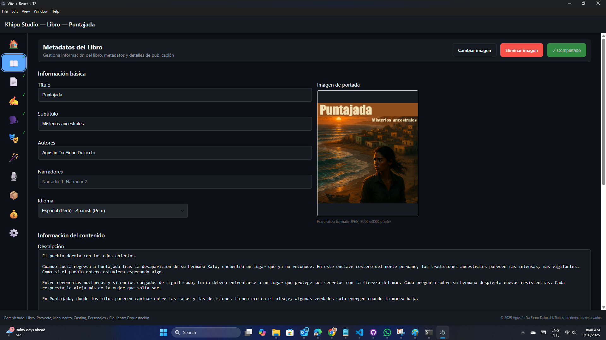
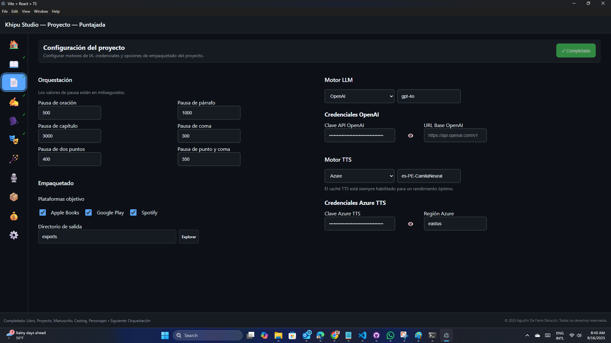
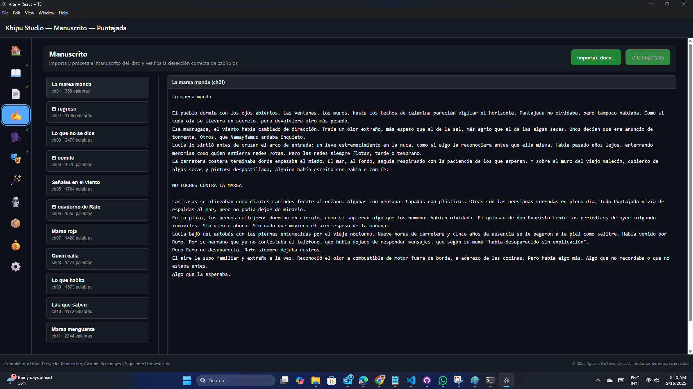
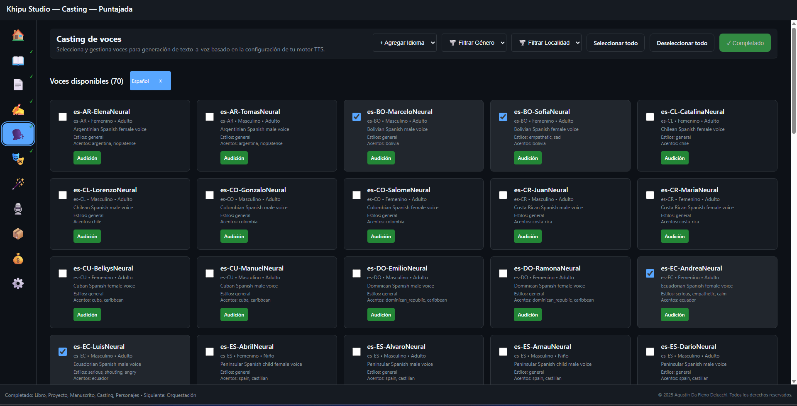
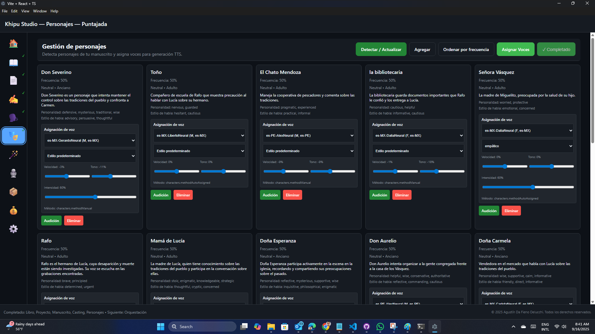
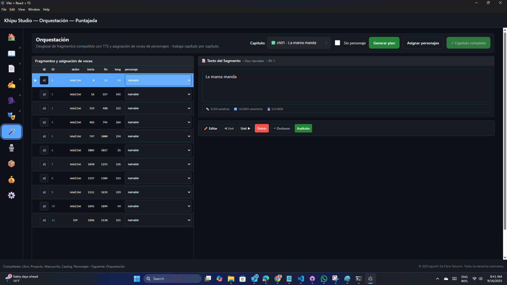
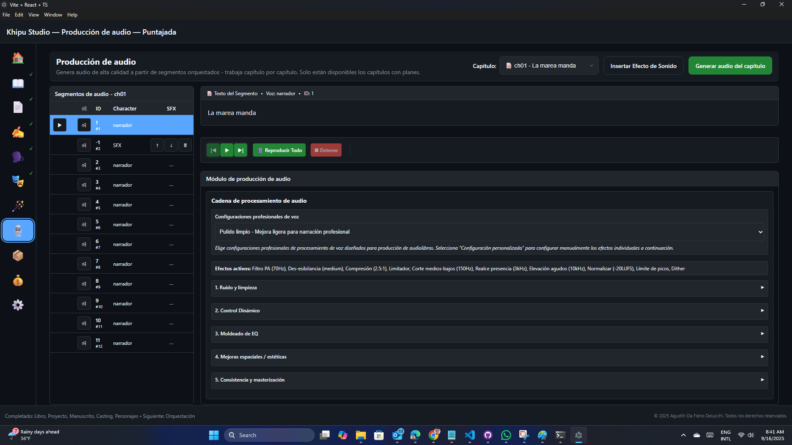
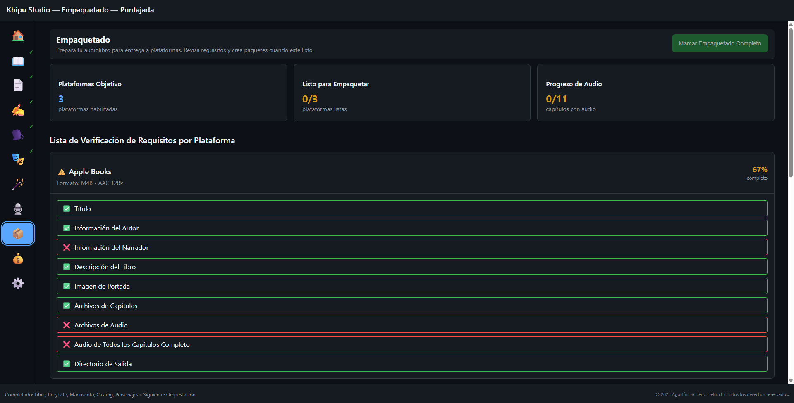
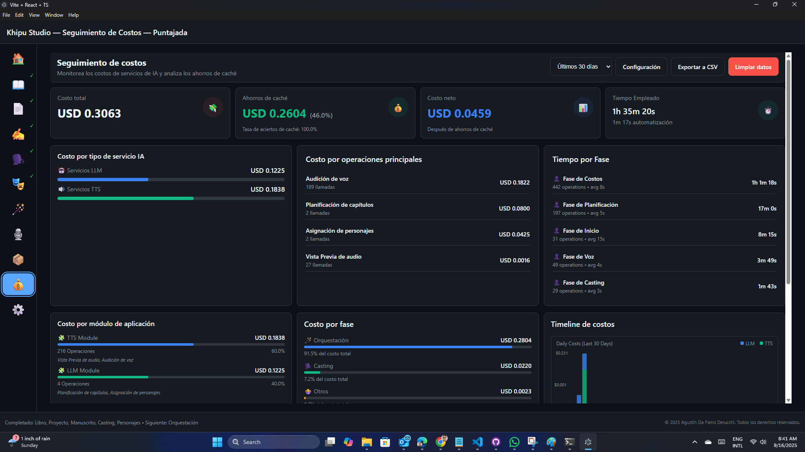
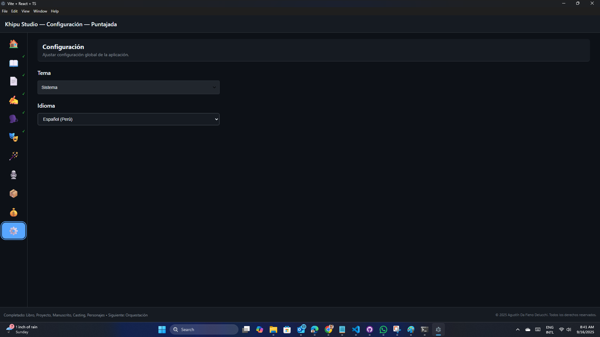

# Khipu Studio - Guía del usuario

## Primeros pasos

Khipu Studio es una aplicación integral para la producción de audiolibros que transforma tu manuscrito escrito en audiolibros de calidad profesional utilizando herramientas potenciadas por IA y tecnología avanzada de texto a voz.

### Vista general de navegación

La aplicación está organizada en 10 módulos principales, cada uno diseñado para manejar un aspecto específico de la producción de audiolibros:

- **🏠 Inicio** - Selección y creación de proyectos
- **📖 Libro** - Metadatos y configuración del libro  
- **📑 Manuscrito** - Gestión y edición de contenido
- **🎭 Personajes** - Detección de personajes y gestión de perfiles
- **🗣️ Casting** - Asignación de voces a personajes
- **🪄 Orquestación** - Segmentación de contenido y asignación de hablantes con IA
- **🎙️ Producción de Audio** - Producción y procesamiento de audio
- **💰 Costo** - Seguimiento de uso y gestión de costos
- **📦 Empaquetado** - Exportación y ensamblaje final
- **⚙️ Configuración** - Preferencias de aplicación y proyecto

## Flujo de trabajo de inicio rápido

### Paso 1: Crear o seleccionar un proyecto
1. Desde la pantalla de **🏠 Inicio**, haz clic en "Nuevo proyecto" para crear un proyecto de audiolibro nuevo

2. O selecciona un proyecto existente para continuar trabajando en él
3. La pantalla de inicio muestra proyectos recientes y proporciona acceso rápido a plantillas

### Paso 2: Configurar detalles del libro
1. Navega a la pestaña **📖 Libro**

2. Ingresa metadatos esenciales:
   - Título y subtítulo del libro
   - Nombre del autor y biografía
   - Género y etiquetas de categoría
   - Detalles de publicación e ISBN (si está disponible)
3. Sube la portada y configura las opciones de visualización
4. Establece preferencias de formato de audio y configuraciones de calidad

### Paso 3: Configurar proyecto
1. Navega a la pestaña **📄 Proyecto**

2. Configura los ajustes técnicos del proyecto:
   - **Orquestación:** Ajusta las pausas de puntuación (oración, párrafo, capítulo, coma, dos puntos, punto y coma)
   - **Motor LLM:** Selecciona y configura el proveedor de IA (OpenAI con credenciales API)
   - **Motor TTS:** Configura el servicio de texto a voz (Azure TTS con credenciales y región)
   - **Empaquetado:** Selecciona plataformas objetivo (Apple Books, Google Play, Spotify, ACX, Kobo)
3. Personaliza pronunciaciones:
   - **Mapa de pronunciación:** Agrega palabras específicas con notación IPA
   - Usa "Sugerir IPA" para obtener pronunciaciones automáticas
   - Elimina entradas incorrectas según sea necesario
4. Guarda la configuración para aplicar los cambios al proyecto

### Paso 4: Importar tu manuscrito
1. Ve a la pestaña **📑 Manuscrito**

2. Importa tu contenido de texto:
   - Sube documentos de Word (.docx)
   - La aplicación detectará automáticamente los capítulos del libro que coincidan con la etiqueta Título 1
3. El previsualizador de manuscrito proporciona:
   - Organización de capítulos y secciones
   - Vista previa del texto
   - La base para que el resto del flujo de trabajo funcione

### Paso 5: Asignar voces
1. Navega a la pestaña **🗣️ Casting**

2. Verás una lista de personajes disponibles proporcionados por el motor TTS seleccionado, así como para el idioma del libro. Luego puedes:
   - Filtrar y seleccionar voces para tu libro (género y configuración regional)
   - Probar muestras de voz para verificar que se ajusten a tu historia
   - Agregar idiomas adicionales más allá de los que coinciden con el idioma principal del libro

### Paso 6: Detectar personajes
1. Cambia a la pestaña **🎭 Personajes**

2. Ejecuta la detección de personajes:
   - Haz clic en "Detectar personajes" para encontrar automáticamente todos los personajes que hablan en tu manuscrito
   - La IA analiza patrones de diálogo y atribución del habla
   - El seguimiento del progreso muestra el estado de detección para cada capítulo
   o para cada personaje, selecciona:
   - Voz específica del casting
   - Parámetros de voz (velocidad, tono, estilo)
3. Prueba muestras de voz para asegurar que las voces de los personajes coincidan con tu visión
4. Configura la voz del narrador para contenido que no es diálogo
5. Agrega y elimina personajes manualmente, según sea necesario

### Paso 7: Planificar segmentos de audio
1. Abre la pestaña **🪄 Orquestación**

2. Segmentación potenciada por IA:
   - El análisis automático de contenido identifica límites óptimos de segmento
   - Asignación de hablantes basada en contexto y detección de personajes
   - Atribución de diálogo y reconocimiento del flujo narrativo
3. Revisar y ajustar:
   - Modificar límites de segmento según sea necesario
   - Verificar que las asignaciones de hablantes sean correctas
   - Bloquear segmentos aprobados para prevenir cambios accidentales

### Paso 8: Generar audio
1. Ve a la pestaña **🎙️ Producción de audio**

2. Proceso de producción de audio:
   - Seleccionar segmentos para generar (individual, capítulo o libro completo)
   - Monitorear el progreso de generación y el estado de la cola
   - Vista previa del audio generado antes de finalizar
3. Características de procesamiento de audio:
   - Reducción de ruido y mejora de audio
   - Normalización de volumen entre segmentos
   - Fundido de entrada/salida y relleno de silencio
   - Efectos de audio personalizados e integración de sonido

### Paso 9: Exportar tu audiolibro
1. Navega a la pestaña **📦 Empaquetado**

2. Ensamblaje final:
   - Combinar todos los segmentos de audio en capítulos
   - Agregar marcadores de capítulo y metadatos
   - Generar archivos de lista de reproducción e información de pistas
3. Opciones de exportación:
   - Formatos de audio de alta calidad (WAV, MP3, M4A)
   - Formatos específicos de audiolibro (M4B con capítulos)
   - Formatos listos para streaming con metadatos incorporados

### Paso 10: Monitorear costos
1. Revisa la pestaña **💰 Costo** regularmente

2. Características de gestión de costos:
   - Seguimiento en tiempo real del uso del servicio TTS
   - Desglose detallado de costos por tipo de operación
   - Análisis de efectividad del caché para optimizar costos

### Configuración de la aplicación
Usa la pestaña **⚙️ Configuración** para cambiar la configuración general para:
- Apariencia de la interfaz de usuario (tema)
- Idioma de la aplicación. Actualmente se admiten inglés (Estados Unidos), portugués (Brasil) y español (Perú)

## Características avanzadas

### IA de detección de personajes
- Analizar automáticamente manuscritos para identificar personajes que hablan
- Analizar patrones de diálogo y atribución del habla
- Manejar estructuras narrativas complejas y hablantes sin nombre
- Seguimiento del progreso para manuscritos grandes con múltiples capítulos

### Segmentación inteligente de audio
- Análisis de contenido potenciado por IA para límites óptimos de segmento de audio
- Asignación automática de hablantes basada en contexto y detección de personajes
- Atribución inteligente de diálogo y reconocimiento del flujo narrativo
- Sistema de bloqueo de segmentos para preservar contenido aprobado

### Pipeline de procesamiento de audio
- Cadena de efectos de audio profesional con reducción de ruido y ecualizador
- Capacidades de procesamiento por lotes para eficiencia
- Sistema de caché para evitar regenerar contenido sin cambios
- Sistema de vista previa para control de calidad antes de la exportación final

### Gestión de costos y análisis
- Seguimiento en tiempo real del uso del servicio TTS y costos asociados
- Desgloses detallados por tipo de operación (detección, generación, procesamiento)
- Alertas de presupuesto y recomendaciones de optimización de costos
- Análisis de efectividad del caché para maximizar ahorros

### Integración de efectos de sonido
- Insertar efectos de sonido personalizados en puntos específicos de tu audiolibro
- Controlar tiempo y volumen con precisión para resultados profesionales
- Construir y gestionar una biblioteca de efectos reutilizables
- Sincronizar efectos con contenido narrativo y diálogo

### Operaciones por lotes y automatización
- Procesar múltiples capítulos simultáneamente para eficiencia
- Aplicar configuraciones consistentes a múltiples segmentos
- Flujos de trabajo de marcado de revisión masiva y procesamiento
- Verificaciones de calidad automatizadas y validación

## Consejos para mejores resultados

### Preparación del manuscrito
- Asegurar atribución clara del diálogo en tu texto
- Usar formato consistente para saltos de capítulo y secciones
- Incluir etiquetas de hablante o indicaciones de acción para ayudar con la detección de personajes
- Limpiar problemas de formato antes de importar

### Selección de voz
- Escuchar muestras de voz para cada personaje antes de comprometerse
- Considerar personalidad, edad y antecedentes del personaje al seleccionar voces
- Probar diálogo entre personajes para asegurar que las voces funcionen bien juntas
- Usar voces distintivas para personajes principales, voces similares para menores

### Control de calidad
- Siempre previsualizar segmentos de audio generados antes de finalizar
- Verificar pronunciaciones incorrectas y ajustar usando ortografía fonética
- Verificar ritmo y tiempo apropiados, especialmente para diálogo
- Probar niveles de audio y asegurar consistencia entre segmentos

### Optimización de costos
- Usar el sistema de caché efectivamente evitando regeneración innecesaria
- Planificar tus segmentos cuidadosamente para minimizar llamadas al servicio TTS
- Monitorear el seguimiento de costos regularmente para mantenerse dentro del presupuesto
- Aprovechar el procesamiento por lotes para mejor eficiencia

### Consejos de rendimiento
- Cerrar aplicaciones innecesarias al procesar proyectos grandes
- Permitir suficiente espacio en disco para caché de audio y archivos temporales
- Usar el sistema de vista previa para probar secciones pequeñas antes de la generación completa
- Guardar tu proyecto frecuentemente para evitar perder progreso

## Solución de problemas

### Problemas comunes
- **Detección de personajes perdiendo hablantes**: Verificar formato de diálogo y agregar entradas de personajes manuales
- **Errores de generación de audio**: Verificar credenciales del servicio TTS y conectividad de red
- **Procesamiento lento**: Cerrar otras aplicaciones y asegurar recursos del sistema adecuados
- **Fallas de exportación**: Verificar espacio disponible en disco y permisos de archivo

### Obtener ayuda
- Verificar la pestaña de configuración para opciones de configuración
- Revisar mensajes de error en la consola de la aplicación
- Asegurar que todos los servicios requeridos (proveedores TTS) estén configurados adecuadamente
- Reiniciar la aplicación si se experimentan problemas persistentes

---

*Esta guía cubre la funcionalidad principal de Khipu Studio. Para especificaciones técnicas detalladas y opciones de configuración avanzadas, consulta la documentación completa de características.*