# Khipu Studio - Guia do usuário

## Introdução

O Khipu Studio é um aplicativo abrangente para produção de audiolivros que transforma seu manuscrito escrito em audiolivros de qualidade profissional usando ferramentas com inteligência artificial e tecnologia avançada de texto para fala.

### Visão geral da navegação

O aplicativo está organizado em 10 módulos principais, cada um projetado para lidar com um aspecto específico da produção de audiolivros:

- **🏠 Início** - Seleção e criação de projetos
- **📖 Livro** - Metadados e configuração do livro  
- **📑 Manuscrito** - Gerenciamento e edição de conteúdo
- **🎭 Personagens** - Detecção de personagens e gerenciamento de perfis
- **🗣️ Casting** - Atribuição de vozes a personagens
- **🪄 Planejamento** - Segmentação de conteúdo e atribuição de falantes com IA
- **🎙️ Voz** - Produção e processamento de áudio
- **💰 Custo** - Acompanhamento de uso e gerenciamento de custos
- **📦 Empacotamento** - Exportação e montagem final
- **⚙️ Configurações** - Preferências de aplicativo e projeto

## Fluxo de trabalho de início rápido

### Passo 1: Criar ou selecionar um projeto
1. Na tela de **🏠 Início**, clique em "Novo projeto" para criar um projeto de audiolivro novo

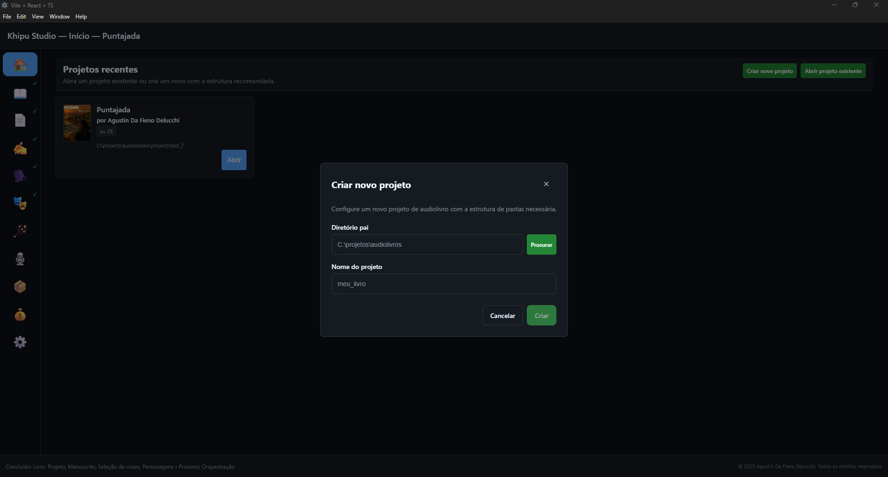

2. Ou selecione um projeto existente para continuar trabalhando nele
3. A tela de início mostra projetos recentes e fornece acesso rápido a modelos

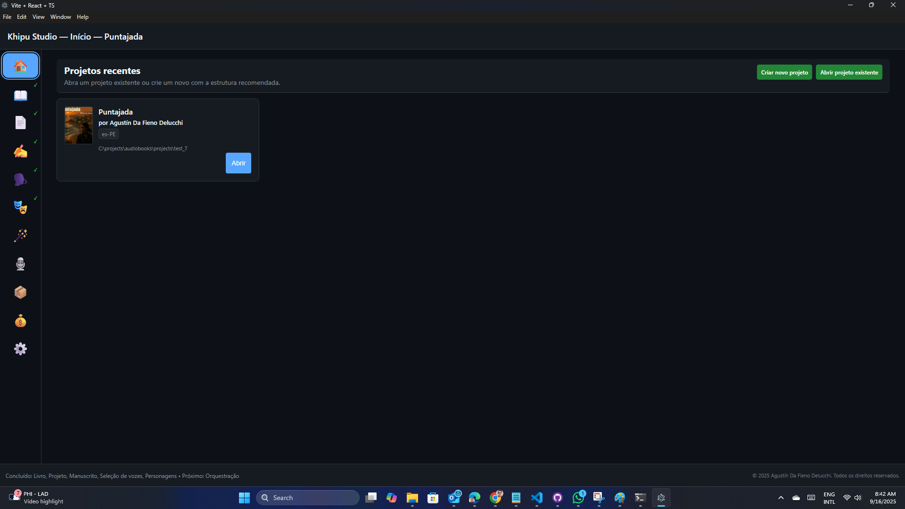

### Passo 2: Configurar detalhes do livro
1. Navegue para a aba **📖 Livro**

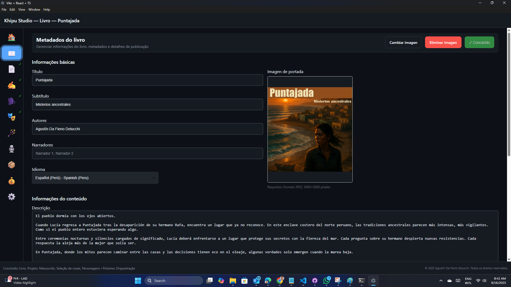

2. Insira metadados essenciais:
   - Título e subtítulo do livro
   - Nome do autor e biografia
   - Gênero e tags de categoria
   - Detalhes de publicação e ISBN (se disponível)
3. Carregue a capa e configure as opções de exibição
4. Defina preferências de formato de áudio e configurações de qualidade

### Passo 3: Importar seu manuscrito
1. Vá para a aba **📑 Manuscrito**

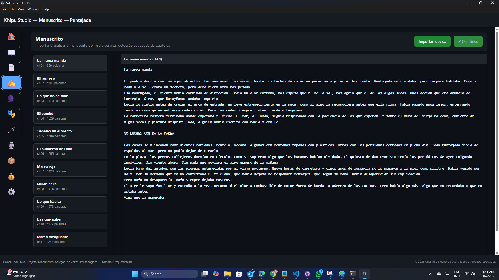

2. Importe seu conteúdo de texto:
   - Carregue documentos do Word (.docx)
   - O aplicativo detectará automaticamente os capítulos do livro que correspondem à tag Título 1
3. O visualizador de manuscrito fornece:
   - Organização de capítulos e seções
   - Visualização do texto
   - A base para o resto do fluxo de trabalho funcionar

### Passo 4: Atribuir vozes
1. Navegue para a aba **🗣️ Casting**

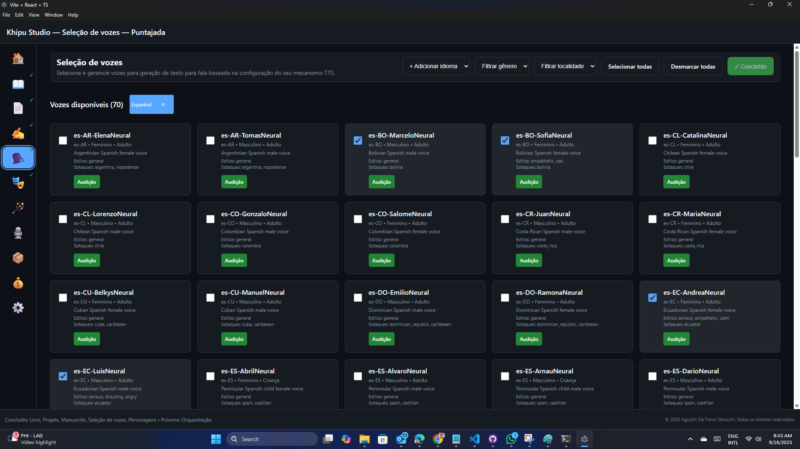

2. Você verá uma lista de personagens disponíveis fornecidos pelo mecanismo TTS selecionado, bem como para o idioma do livro. Você pode então:
   - Filtrar e selecionar vozes para seu livro (gênero e localização)
   - Testar amostras de voz para verificar se se ajustam à sua história
   - Adicionar idiomas adicionais além daqueles que correspondem ao idioma principal do livro

### Passo 5: Detectar personagens
1. Mude para a aba **🎭 Personagens**

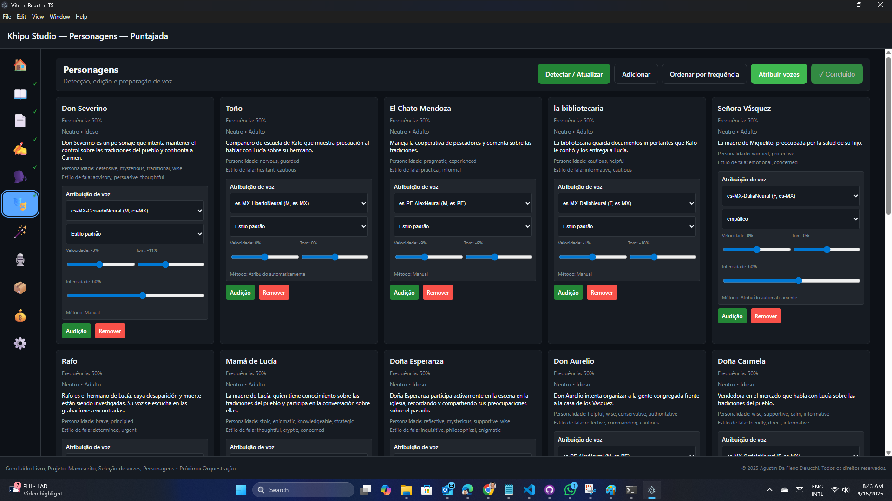

2. Execute a detecção de personagens:
   - Clique em "Detectar personagens" para encontrar automaticamente todos os personagens falantes em seu manuscrito
   - A IA analisa padrões de diálogo e atribuição de fala
   - O acompanhamento do progresso mostra o status de detecção para cada capítulo
   ou para cada personagem, selecione:
   - Voz específica do casting
   - Parâmetros de voz (velocidade, tom, estilo)
3. Teste amostras de voz para garantir que as vozes dos personagens correspondam à sua visão
4. Configure a voz do narrador para conteúdo que não é diálogo
5. Adicione e remova personagens manualmente, conforme necessário

### Passo 6: Planejar segmentos de áudio
1. Abra a aba **🪄 Orquestração**

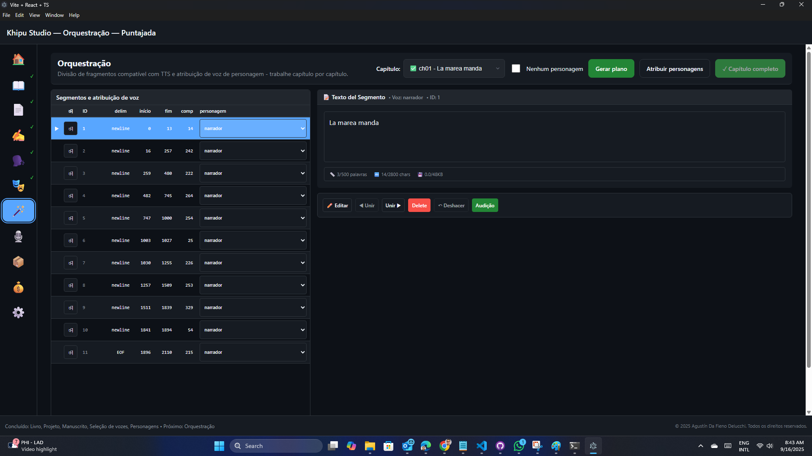

2. Segmentação com inteligência artificial:
   - Análise automática de conteúdo identifica limites ótimos de segmento
   - Atribuição de falantes baseada em contexto e detecção de personagens
   - Atribuição de diálogo e reconhecimento do fluxo narrativo
3. Revisar e ajustar:
   - Modificar limites de segmento conforme necessário
   - Verificar se as atribuições de falantes estão corretas
   - Bloquear segmentos aprovados para prevenir mudanças acidentais

### Passo 7: Gerar áudio
1. Vá para a aba **🎙️ Produção de áudio**

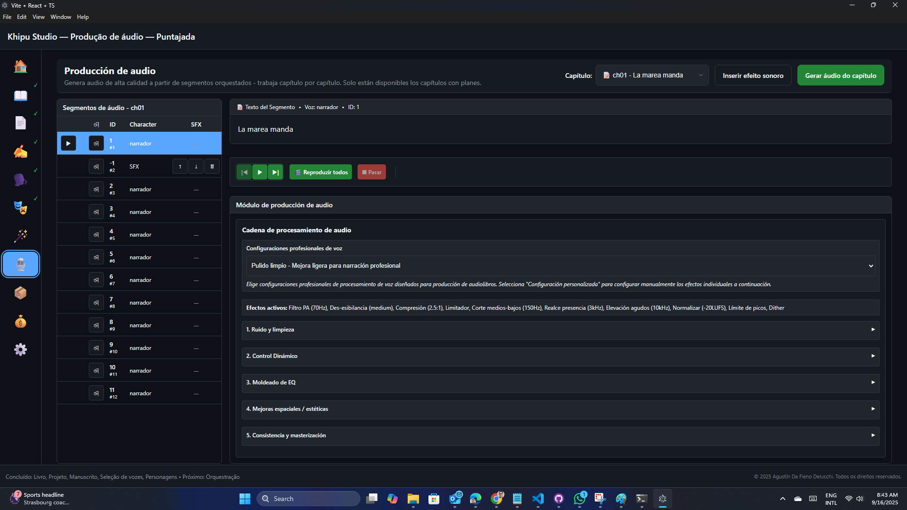

2. Processo de produção de áudio:
   - Selecionar segmentos para gerar (individual, capítulo ou livro completo)
   - Monitorar progresso de geração e status da fila
   - Visualizar áudio gerado antes de finalizar
3. Recursos de processamento de áudio:
   - Redução de ruído e aprimoramento de áudio
   - Normalização de volume entre segmentos
   - Fade in/out e preenchimento de silêncio
   - Efeitos de áudio personalizados e integração de som

### Passo 8: Exportar seu audiolivro
1. Navegue para a aba **📦 Empacotamento**

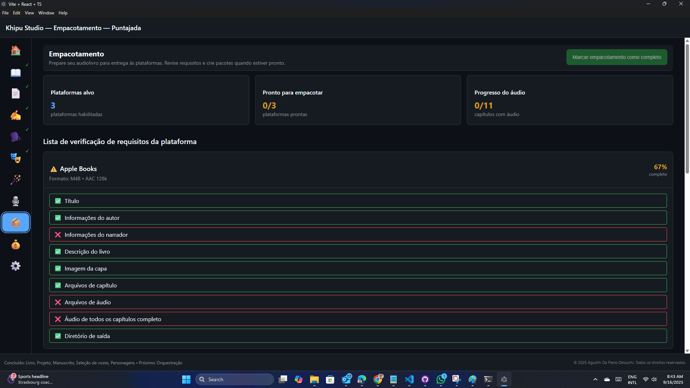

2. Montagem final:
   - Combinar todos os segmentos de áudio em capítulos
   - Adicionar marcadores de capítulo e metadados
   - Gerar arquivos de playlist e informações de faixa
3. Opções de exportação:
   - Formatos de áudio de alta qualidade (WAV, MP3, M4A)
   - Formatos específicos de audiolivro (M4B com capítulos)
   - Formatos prontos para streaming com metadados incorporados

### Passo 9: Monitorar custos
1. Verifique a aba **💰 Custo** regularmente

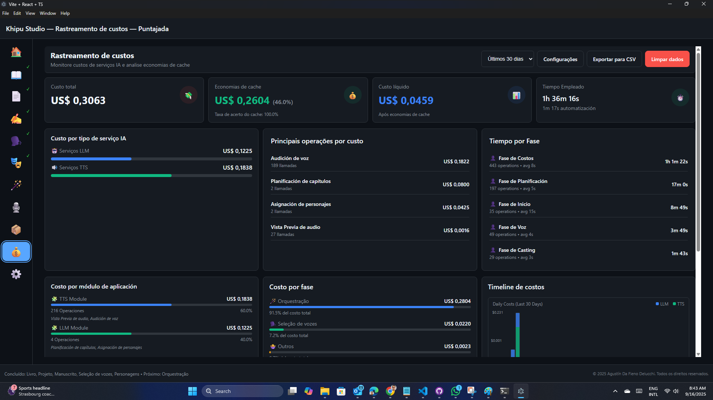

2. Recursos de gerenciamento de custos:
   - Acompanhamento em tempo real do uso do serviço TTS
   - Detalhamento detalhado de custos por tipo de operação
   - Análise de efetividade do cache para otimizar custos

### Configurações do aplicativo
Use a aba **⚙️ Configurações** para alterar configurações gerais para:
- Aparência da interface do usuário (tema)
- Idioma do aplicativo. Atualmente são suportados inglês (Estados Unidos), português (Brasil) e espanhol (Peru)

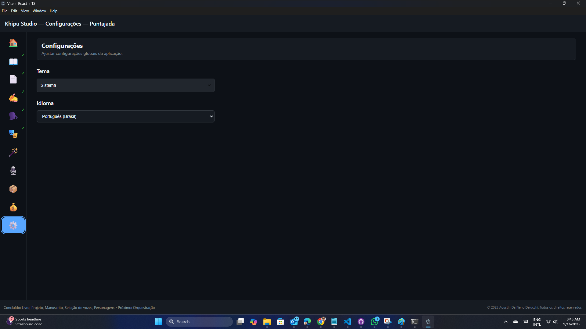

## Recursos avançados

### IA de detecção de personagens
- Analisar automaticamente manuscritos para identificar personagens falantes
- Analisar padrões de diálogo e atribuição de fala
- Lidar com estruturas narrativas complexas e falantes sem nome
- Acompanhamento de progresso para manuscritos grandes com múltiplos capítulos

### Segmentação inteligente de áudio
- Análise de conteúdo com inteligência artificial para limites ótimos de segmento de áudio
- Atribuição automática de falantes baseada em contexto e detecção de personagens
- Atribuição inteligente de diálogo e reconhecimento do fluxo narrativo
- Sistema de bloqueio de segmentos para preservar conteúdo aprovado

### Pipeline de processamento de áudio
- Cadeia de efeitos de áudio profissional com redução de ruído e equalizador
- Capacidades de processamento em lote para eficiência
- Sistema de cache para evitar regenerar conteúdo inalterado
- Sistema de visualização para controle de qualidade antes da exportação final

### Gerenciamento de custos e análise
- Acompanhamento em tempo real do uso do serviço TTS e custos associados
- Detalhamentos detalhados por tipo de operação (detecção, geração, processamento)
- Alertas de orçamento e recomendações de otimização de custos
- Análise de efetividade do cache para maximizar economias

### Integração de efeitos sonoros
- Inserir efeitos sonoros personalizados em pontos específicos do seu audiolivro
- Controlar tempo e volume com precisão para resultados profissionais
- Construir e gerenciar uma biblioteca de efeitos reutilizáveis
- Sincronizar efeitos com conteúdo narrativo e diálogo

### Operações em lote e automação
- Processar múltiplos capítulos simultaneamente para eficiência
- Aplicar configurações consistentes a múltiplos segmentos
- Fluxos de trabalho de marcação de revisão em massa e processamento
- Verificações de qualidade automatizadas e validação

## Dicas para melhores resultados

### Preparação do manuscrito
- Garantir atribuição clara do diálogo em seu texto
- Usar formatação consistente para quebras de capítulo e seções
- Incluir tags de falante ou indicações de ação para ajudar na detecção de personagens
- Limpar problemas de formatação antes de importar

### Seleção de voz
- Ouvir amostras de voz para cada personagem antes de se comprometer
- Considerar personalidade, idade e histórico do personagem ao selecionar vozes
- Testar diálogo entre personagens para garantir que as vozes funcionem bem juntas
- Usar vozes distintivas para personagens principais, vozes similares para menores

### Controle de qualidade
- Sempre visualizar segmentos de áudio gerados antes de finalizar
- Verificar pronúncias incorretas e ajustar usando ortografia fonética
- Verificar ritmo e timing apropriados, especialmente para diálogo
- Testar níveis de áudio e garantir consistência entre segmentos

### Otimização de custos
- Usar o sistema de cache efetivamente evitando regeneração desnecessária
- Planejar seus segmentos cuidadosamente para minimizar chamadas do serviço TTS
- Monitorar acompanhamento de custos regularmente para manter-se dentro do orçamento
- Aproveitar o processamento em lote para melhor eficiência

### Dicas de performance
- Fechar aplicativos desnecessários ao processar projetos grandes
- Permitir espaço suficiente em disco para cache de áudio e arquivos temporários
- Usar o sistema de visualização para testar seções pequenas antes da geração completa
- Salvar seu projeto frequentemente para evitar perder progresso

## Solução de problemas

### Problemas comuns
- **Detecção de personagens perdendo falantes**: Verificar formatação de diálogo e adicionar entradas de personagens manuais
- **Erros de geração de áudio**: Verificar credenciais do serviço TTS e conectividade de rede
- **Processamento lento**: Fechar outros aplicativos e garantir recursos do sistema adequados
- **Falhas de exportação**: Verificar espaço disponível em disco e permissões de arquivo

### Obter ajuda
- Verificar a aba de configurações para opções de configuração
- Revisar mensagens de erro no console do aplicativo
- Garantir que todos os serviços necessários (provedores TTS) estejam configurados adequadamente
- Reiniciar o aplicativo se experimentar problemas persistentes

---

*Este guia cobre a funcionalidade principal do Khipu Studio. Para especificações técnicas detalhadas e opções de configuração avançadas, consulte a documentação completa de recursos.*