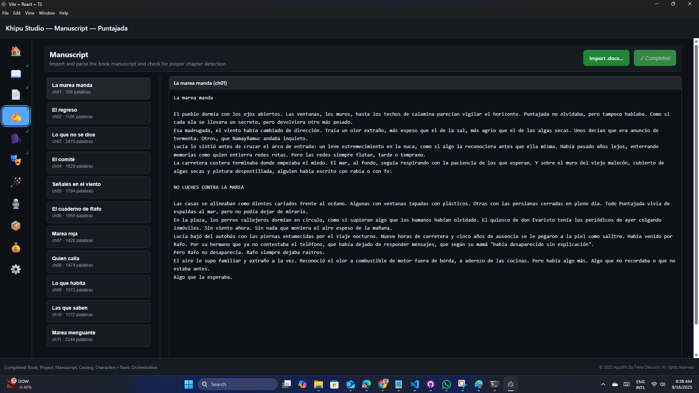
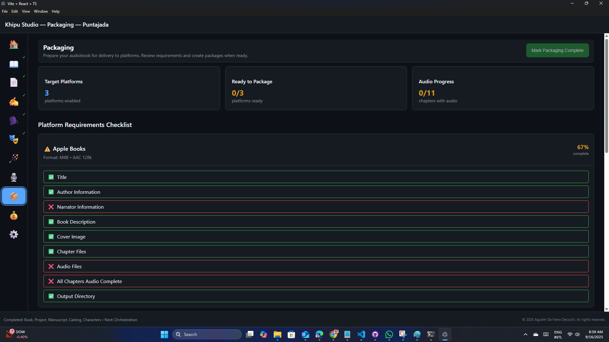

# Khipu Studio - User Guide

## Getting Started

Khipu Studio is a comprehensive audiobook production application that transforms your written manuscript into professional-quality audiobooks using AI-powered tools and advanced text-to-speech technology.

### Navigation Overview

The application is organized into 10 main modules, each designed to handle a specific aspect of audiobook production:

- **🏠 Home** - Project selection and creation
- **📖 Book** - Book metadata and configuration  
- **📑 Manuscript** - Content management and editing
- **🎭 Characters** - Character detection and profile management
- **🗣️ Casting** - Voice assignment to characters
- **🪄 Planning** - AI-powered content segmentation and speaker assignment
- **🎙️ Voice** - Audio production and processing
- **💰 Cost** - Usage tracking and cost management
- **📦 Packaging** - Export and final assembly
- **⚙️ Settings** - Application and project preferences

## Quick Start Workflow

### Step 1: Create or Select a Project
1. From the **🏠 Home** screen, click "New Project" to create a fresh audiobook project

2. Or select an existing project to continue working on it
3. The home screen shows recent projects and provides quick access to templates

### Step 2: Configure Book Details
1. Navigate to the **📖 Book** tab

2. Enter essential metadata:
   - Book title and subtitle
   - Author name and biography
   - Genre and category tags
   - Publication details and ISBN (if available)
3. Upload cover art and configure display settings
4. Set audio format preferences and quality settings

### Step 3: Import Your Manuscript
1. Go to the **📑 Manuscript** tab

2. Import your text content:
   - Upload Word documents (.docx)
   - The application will automatically detect the book's chapters matching the Heading 1 tag
3. The manuscript previewer provides:
   - Chapter and section organization
   - Text preview
   - The basis for the rest of the workflow to work with

### Step 4: Assign Voices
1. Navigate to the **🗣️ Casting** tab

2. You will see a list of available characters provided by the selected TTS engine, as well as for the book language. You can then:
   - Filter and select voices for your book (gender and locale)
   - Test voice samples to check for voice fit into your story
   - Add additional languages beyond those matching the book's main language

### Step 5: Detect Characters
1. Switch to the **🎭 Characters** tab

2. Run character detection:
   - Click "Detect Characters" to automatically find all speaking characters in your manuscript
   - The AI analyzes dialogue patterns and speech attribution
   - Progress tracking shows detection status for each chapter
   or each character, select:
    -- Specific voice from the casting
    -- Voice parameters (speed, pitch, style)
3. Test voice samples to ensure character voices match your vision
4. Configure narrator voice for non-dialogue content
5. Manually add and remove characters, as needed

### Step 6: Plan Audio Segments
1. Open the **🪄 Orchestration** tab

2. AI-powered segmentation:
   - Automatic content analysis identifies optimal segment boundaries
   - Speaker assignment based on context and character detection
   - Dialogue attribution and narrative flow recognition
3. Review and adjust:
   - Modify segment boundaries as needed
   - Verify speaker assignments are correct
   - Lock approved segments to prevent accidental changes

### Step 7: Generate Audio
1. Go to the **🎙️ Audio Production** tab

2. Audio production process:
   - Select segments to generate (individual, chapter, or full book)
   - Monitor generation progress and queue status
   - Preview generated audio before finalizing
3. Audio processing features:
   - Noise reduction and audio enhancement
   - Volume normalization across segments
   - Fade in/out and silence padding
   - Custom audio effects and sound integration

### Step 8: Export Your Audiobook
1. Navigate to the **📦 Packaging** tab

2. Final assembly:
   - Combine all audio segments into chapters
   - Add chapter markers and metadata
   - Generate playlist files and track information
3. Export options:
   - High-quality audio formats (WAV, MP3, M4A)
   - Audiobook-specific formats (M4B with chapters)
   - Streaming-ready formats with embedded metadata

### Step 9: Monitor Costs
1. Check the **💰 Cost** tab regularly

2. Cost management features:
   - Real-time tracking of TTS service usage
   - Detailed cost breakdown by operation type
   - Cache effectiveness analysis to optimize costs

### Application Settings
Use the **💰 Settings** tab to change overall settings for:
    - User interface appearance (theme)
    - Application language. English (United States), Portuguese (Brazil), and Spanish (Peru) are currently supported

## Advanced Features

### Character Detection AI
- Automatically analyze manuscripts to identify speaking characters
- Parse dialogue patterns and speech attribution
- Handle complex narrative structures and unnamed speakers
- Progress tracking for large manuscripts with multiple chapters

### Intelligent Audio Segmentation
- AI-powered content analysis for optimal audio segment boundaries
- Automatic speaker assignment based on context and character detection
- Smart dialogue attribution and narrative flow recognition
- Segment locking system to preserve approved content

### Audio Processing Pipeline
- Professional audio effects chain with noise reduction and EQ
- Batch processing capabilities for efficiency
- Caching system to avoid regenerating unchanged content
- Preview system for quality control before final export

### Cost Management and Analytics
- Real-time tracking of TTS service usage and associated costs
- Detailed breakdowns by operation type (detection, generation, processing)
- Budget alerts and cost optimization recommendations
- Cache effectiveness analysis to maximize savings

### Sound Effects Integration
- Insert custom sound effects at specific points in your audiobook
- Control timing and volume precisely for professional results
- Build and manage a library of reusable effects
- Sync effects with narrative content and dialogue

### Batch Operations and Automation
- Process multiple chapters simultaneously for efficiency
- Apply consistent settings across multiple segments
- Bulk revision marking and processing workflows
- Automated quality checks and validation

## Tips for Best Results

### Manuscript Preparation
- Ensure clear dialogue attribution in your text
- Use consistent formatting for chapter breaks and sections
- Include speaker tags or action beats to help with character detection
- Clean up formatting issues before importing

### Voice Selection
- Listen to voice samples for each character before committing
- Consider character personality, age, and background when selecting voices
- Test dialogue between characters to ensure voices work well together
- Use distinct voices for main characters, similar voices for minor ones

### Quality Control
- Always preview generated audio segments before finalizing
- Check for mispronunciations and adjust using phonetic spelling
- Verify proper pacing and timing, especially for dialogue
- Test audio levels and ensure consistency across segments

### Cost Optimization
- Use the caching system effectively by avoiding unnecessary regeneration
- Plan your segments thoughtfully to minimize TTS service calls
- Monitor cost tracking regularly to stay within budget
- Take advantage of bulk processing for better efficiency

### Performance Tips
- Close unnecessary applications when processing large projects
- Allow sufficient disk space for audio cache and temporary files
- Use the preview system to test small sections before full generation
- Save your project frequently to avoid losing progress

## Troubleshooting

### Common Issues
- **Character detection missing speakers**: Check dialogue formatting and add manual character entries
- **Audio generation errors**: Verify TTS service credentials and network connectivity
- **Slow processing**: Close other applications and ensure adequate system resources
- **Export failures**: Check available disk space and file permissions

### Getting Help
- Check the Settings tab for configuration options
- Review error messages in the application console
- Ensure all required services (TTS providers) are properly configured
- Restart the application if experiencing persistent issues

---

*This guide covers the core functionality of Khipu Studio. For detailed technical specifications and advanced configuration options, refer to the complete feature documentation.*